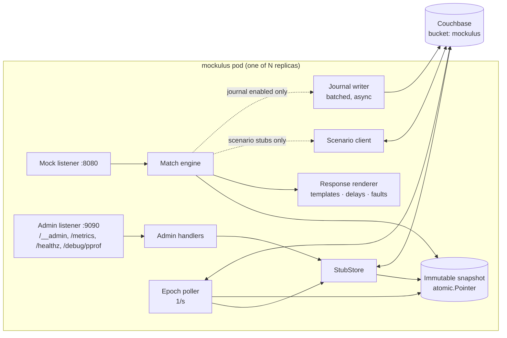

# Mockulus — Technical Specification & Implementation Plan

| | |
|---|---|
| **Status** | Approved for implementation |
| **Version** | 1.0 |
| **Date** | 2026-07-22 |
| **Scope** | v1.0 of Mockulus (`mockulus`) — a cloud-native, WireMock-API-compatible mock server |
| **Companion doc** | [ROADMAP.md](ROADMAP.md) — deferred features and non-goals |

This document is the authoritative implementation guide. Where it conflicts with memory of how WireMock behaves, the **differential compatibility harness** (§5.6) against a pinned WireMock version is the tiebreaker, and this document must be updated to record the verified behavior.

---

## Table of contents

1. [Purpose & product definition](#1-purpose--product-definition)
2. [Guiding principles](#2-guiding-principles)
3. [Architecture decision record](#3-architecture-decision-record)
4. [System architecture](#4-system-architecture)
5. [Compatibility contract](#5-compatibility-contract)
6. [Matching engine](#6-matching-engine)
7. [Storage & data model](#7-storage--data-model)
8. [Cluster synchronization](#8-cluster-synchronization)
9. [Scenarios (stateful mocks)](#9-scenarios-stateful-mocks)
10. [Response templating](#10-response-templating)
11. [Request journal & verification](#11-request-journal--verification)
12. [HTTP layer](#12-http-layer)
13. [Configuration reference](#13-configuration-reference)
14. [Observability](#14-observability)
15. [Kubernetes deployment](#15-kubernetes-deployment)
16. [Performance engineering](#16-performance-engineering)
17. [Security](#17-security)
18. [Code organization](#18-code-organization)
19. [Testing strategy & the E2E regression gate](#19-testing-strategy--the-e2e-regression-gate)
20. [Implementation plan](#20-implementation-plan)
21. [Risks & mitigations](#21-risks--mitigations)
22. [Open source & licensing](#22-open-source--licensing)
- [Appendix A — Annotated stub mapping example](#appendix-a--annotated-stub-mapping-example)
- [Appendix B — Error catalog](#appendix-b--error-catalog)
- [Appendix C — Items pending differential verification](#appendix-c--items-pending-differential-verification)

---

## 1. Purpose & product definition

**Mockulus** (Mock + Cumulus — cloud-native mocking; binary `mockulus`) is a mock/stub HTTP server that is wire-compatible with a defined subset of the WireMock 3.x admin API and stub-mapping JSON format, designed from scratch to be cloud native:

- Runs as **N stateless-ish replicas** behind a Kubernetes Service; any replica can serve any request and any admin call.
- **Persists stubs in Couchbase** (source of truth); serves all mock traffic from an in-memory snapshot.
- **High throughput / low latency**: ≥50k RPS on a 2-vCPU pod, p99 < 2 ms (§16 SLOs).
- **Zero-config start**: `docker run mockulus` works with an in-memory store; adding Couchbase env vars enables persistence and clustering.
- Existing test suites that use WireMock's REST admin API — including via the official WireMock client libraries pointed at a remote host — work unchanged as long as they use supported features. Anything unsupported **fails loudly** with a 422 naming the offending fields.

### What v1 is NOT

No XML/XPath matching, no proxying, no record/playback, no webhooks, no gRPC, no browser proxying, no Java-class extensions, no multipart matching, no JSON Schema matching, no admin UI. All are catalogued with design sketches in [ROADMAP.md](ROADMAP.md). Stubs that use these features are rejected with 422 + error detail (never silently ignored).

### Primary use cases

1. **Load/performance testing**: dependency mocks that never become the bottleneck.
2. **Functional/integration test suites** in CI: register stubs per test, verify received requests, stateful flows.
3. **Shared environment mocks**: long-lived mocks for downstream services in dev/staging clusters, surviving pod restarts via Couchbase.

**Shared-deployment isolation caveat**: one deployment = one global namespace for stubs, scenarios, and the journal. Concurrent CI runners sharing a deployment must keep their stubs distinguishable (unique URLs / scenario names), tag them via `metadata` (e.g. `"suite": "<run-id>"`) and clean up with `remove-by-metadata` — and must **not** call global resets (`POST /__admin/reset`, `DELETE /__admin/mappings`), which destroy every runner's stubs. Runners needing real isolation get their own instance (single-replica `memory` mode, §15.4) or their own deployment (D12).

---

## 2. Guiding principles

These four principles resolve most design disputes; deviations require an ADR entry in §3.

- **P1 — The hot path does no I/O.** Serving a mock request never touches Couchbase, disk, or any network dependency — matching runs against an immutable in-memory snapshot. Exceptions are individually justified and opt-in: scenario-state reads (only for stubs in a scenario) and journal writes (only when the journal is enabled, and then async/batched).
- **P2 — Every expensive feature is pay-per-use.** Stubs that don't use templating, scenarios, or journaling must cost exactly nothing extra at request time. Features default to their cheap setting.
- **P3 — Fail loudly on unsupported input.** A stub or admin call using an unsupported WireMock feature is rejected at registration time with 422 and a machine-readable list of offending JSON pointers. We never accept-and-ignore: a stub that registers successfully behaves as WireMock would (within documented deviations, §5.5).
- **P4 — Zero-config first, everything tunable.** Sane defaults for every knob; a plain binary/container start must be useful. Configuration via environment variables (K8s-idiomatic), optional YAML file.

---

## 3. Architecture decision record

Decisions made 2026-07-22 with the project owner. Format: decision → rationale → rejected alternatives.

| # | Decision | Rationale | Rejected |
|---|---|---|---|
| D1 | **Go** (≥1.24), single static binary | Operational profile fits HPA scale-out: ~15 MB image, <100 ms cold start, ~40 MB RSS. Workload is protocol plumbing + a matching engine — Java's library advantage barely applies. Team ramp-up acceptable at this codebase size (~10–15k LOC). | GraalVM native Java (loses JIT peak throughput, reflection-config tax, Quarkus is its own learning curve); JVM Java (cold start/memory fights autoscaling); Rust (team cost, overkill) |
| D2 | **Strict WireMock-subset wire compatibility**; 422 on unsupported fields; own additions (if ever) under a separate namespace | Existing suites + WireMock client libraries work unchanged; fail-loud makes the supported subset self-documenting | Own cleaner API (forces migration, loses client libs); dual API in v1 (two surfaces to maintain) |
| D3 | **Journal opt-in, Couchbase-backed** (async batched writes, TTL); verification reads from CB so results are correct across replicas | Always-on journaling at 50k RPS = 50k writes/s — recreates WireMock's collapse. Per-pod buffers give wrong `verify()` answers behind a load balancer | Always-on per-pod ring buffer; dropping verification |
| D4 | **Epoch polling** for stub propagation: version counter doc in CB, 1 KV get per pod per interval (default 1 s) | No extra infra, trivially robust, bounded staleness fine for test-setup semantics. DCP is a drop-in v2 upgrade behind the same interface | Couchbase DCP in v1 (heavier moving part); NATS/Redis bus (new infra dependency); no sync |
| D5 | **Lean v1 scope**: core matching/response features only; XML/XPath, proxy, recording, webhooks, etc. deferred to ROADMAP.md | Ship the performance core first; every deferred feature has a documented design sketch so v2 work starts from a plan | Including XML+proxy in v1 |
| D6 | **Scenarios distributed via Couchbase** KV + CAS; only scenario-member stubs read state (~1 KV get), transitions CAS-retried | Correct with any replica count; P2 preserved (non-scenario stubs unaffected) | Per-pod local state (wrong behind LB); dropping scenarios |
| D7 | **Handlebars-compatible templating subset** via an in-repo engine (`internal/handlebars`); templates compiled at registration; unknown helpers → 422 | Preserves D2 for the very common templated-stub case | Go `text/template` (breaks every existing templated stub); no templating |
| D8 | **`net/http`** on all listeners | HTTP/1.1 + HTTP/2 (h2c), TLS, connection hijacking for fault injection, battle-tested. Clears SLOs with zero-alloc handler discipline | `fasthttp` (no HTTP/2, buffer-reuse footguns; revisit only if the perf gate fails) |
| D9 | **Storage behind a `StubStore` interface**; drivers: `couchbase` (prod), `memory` (zero-config/dev/tests), `file` (reads a WireMock `mappings/` dir; single-replica dev) | Testability; zero-config start; local parity with WireMock projects | Couchbase-only (kills zero-config + unit testing) |
| D10 | **Two listeners**: mock traffic `:8080`, admin+ops `:9090`; `/__admin` additionally served on the mock port by default (flag to disable) | WireMock clients default to same-port `/__admin` (compat); ops endpoints separated so ingress exposes only 8080 | Single port (can't harden); admin-port-only (breaks drop-in) |
| D11 | **Benchmark-first development**: load harness and CI perf gate exist from M0; SLOs in §16 are release criteria | "Fast" must be falsifiable | Perf as a final phase |
| D12 | **No in-app multi-tenancy** in v1 — deployment-per-team via namespaces; each deployment gets its own bucket/scope | Isolation via K8s primitives; keeps the core simple | Tenant-id headers/keyspaces in-app |

---

## 4. System architecture

### 4.1 Component overview



Components (each maps to a package, §18):

| Component | Responsibility |
|---|---|
| **Mock listener** | `net/http` server for mock traffic; parses requests into a pooled `ParsedRequest`; also serves `/__admin` (delegating to admin handlers) unless disabled |
| **Admin listener** | `/__admin/**` handlers, `/healthz`, `/readyz`, `/metrics`, `/debug/pprof` |
| **Match engine** | Holds the current `*Snapshot` in an `atomic.Pointer[Snapshot]`; pure-function matching (§6) |
| **Snapshot builder** | Compiles raw stub docs → `CompiledStub`s (regexes, JSONPath, templates precompiled), builds indexes, produces a new immutable `Snapshot` |
| **StubStore** | Persistence interface (§7.1); drivers `couchbase`, `memory`, `file` |
| **Epoch poller** | Polls the epoch counter; triggers snapshot rebuild on change (§8) |
| **Scenario client** | KV get/CAS operations for scenario state (§9) |
| **Journal writer** | Bounded channel + batch flusher to CB (§11) |
| **Response renderer** | Status/headers/body assembly, template rendering, delay simulation, fault injection (§10, §12) |

### 4.2 Request lifecycle (mock port)

```
1. Accept request → acquire ParsedRequest from sync.Pool; read body (cap: max_body_bytes, else 413).
2. snap := engine.snapshot.Load()          // one atomic load, no locks
3. stub := Match(snap, req)                // §6.4 — lazy parsing of query/cookies/form/JSON body
4. If no stub:
     404 with WireMock-compatible "not matched" plain-text body.
     Near-miss diagnostics ONLY if diagnostics_on_unmatched enabled (§5.4).
5. If stub is in a scenario: KV get scenario state; skip stub if state mismatch (back to 3's iteration).
6. Render response: resolve body (inline/base64/file-backed, pre-resolved at snapshot build),
   run template if stub has templating, apply delay, apply fault (hijack) or write response.
7. If stub sets newScenarioState: CAS transition (§9.3).
8. If journal enabled: enqueue journal entry (never blocks; drop+count on overflow).
9. Release ParsedRequest to pool. Metrics observed in all paths.
```

### 4.3 Admin write lifecycle (create/update stub)

```
1. Decode JSON. Unknown/unsupported fields → 422 with JSON-pointer list (§5.5). Nothing persisted.
2. Compile the stub (regexes incl. regexp2 fallback, JSONPath, templates). Compilation failure
   → 422. Nothing persisted.                       // invalid stubs can never enter the store
   bodyFileName existence is NOT checked here — registering a stub before uploading its file is
   legal (WM parity); the reference resolves at snapshot build (§6.9).
3. Persist doc to StubStore (durability per config, default none). POST/creates draw a fresh
   insertion sequence from the CB atomic counter (§7.3); PUT/overwrite of an existing id
   PRESERVES its seq — editing a stub must not change its match precedence (§5.3).
4. Increment epoch counter.
5. Swap immediately on this pod via incremental splice: clone the current snapshot with just
   this one compiled stub inserted/replaced at its sorted position (known from priority+seq;
   map/slice copy, no recompile — ms-scale even at 10k stubs; deletes splice out analogously).
   Single-pod test flows see zero staleness. The level-triggered full reload (§8) follows
   within sync_interval on every pod and reconciles concurrent writes.
6. Return WireMock-compatible response (201 + stub JSON with server-assigned id/uuid).
```

Other pods converge via the epoch poller within `sync_interval` (default 1 s). Concurrent admin writes from many test runners are safe: convergence is **level-triggered** (any epoch change → full reload of current store state), so lost-update races on the *signal* are impossible; per-doc last-write-wins applies to the stubs themselves.

### 4.4 Startup sequence

```
1. Load config (env → optional YAML file → defaults). Validate; on error exit 1 with a clear message.
2. Start admin listener immediately: /healthz=200 (live), /readyz=503 (not ready).
3. Connect StubStore with retry+backoff (couchbase driver: waitUntilReady, then bootstrap
   collections/indexes if absent, §7.2).
4. Full load: read all mapping docs + files, build snapshot. Record load duration metric.
5. Start epoch poller, journal writer (if enabled), mock listener.
6. /readyz=200. Log a single startup summary line (version, store, stub count, load ms).
```

If Couchbase is unreachable at boot: stay alive but not-ready, retry forever (K8s-idiomatic). Optional escape hatch `start_without_store: true` (default false) becomes ready with an empty snapshot so mock traffic can be served; admin writes still return 503 until the store connects — the mode never buffers writes in memory, so reconnection has nothing to lose or reconcile.

### 4.5 Shutdown sequence

`SIGTERM` → `/readyz` flips to 503 → wait `shutdown_drain` (default 5 s, ≥ readiness propagation) → `http.Server.Shutdown` both listeners (context timeout `shutdown_timeout`, default 15 s) → flush journal batch → close store → exit 0.

### 4.6 Degraded modes (explicit contract)

| Condition | Behavior |
|---|---|
| CB down, snapshot loaded | Keep serving mock traffic from the last snapshot. Admin **writes** → 503 `storeUnavailable`. Scenario-stub requests → 500 `scenarioUnavailable` (correctness over availability; plain stubs unaffected). Journal entries dropped + counted. `/readyz` stays 200 (we can serve), `/healthz` stays 200; store health exposed via metric + `/__admin/health` detail. |
| CB down at boot | Not ready; retry forever (§4.4). |
| Store read fails during rebuild (`LoadAll` error) | Keep previous snapshot; log error + `mockulus_snapshot_reload_failures_total`; retry next poll tick. Individual bad/undecodable/uncompilable docs never abort a build — quarantined per §6.9. |
| Journal queue full | Drop entry, increment `mockulus_journal_dropped_total`. Never block or slow the hot path. |

---

## 5. Compatibility contract

Reference implementation: **WireMock pinned docker image `wiremock/wiremock:3.13.2`** — the latest stable release as of 2026-07-24 (WireMock 4.0 exists only as betas and becomes a pin candidate when it goes stable; bumping the pin follows the §5.6 record-mode workflow). The pin is recorded in `test/e2e/WIREMOCK_VERSION`. "WM" below means that pinned version. Items marked **[DH]** must be verified against WM by the differential harness (§5.6) and this spec updated with the verified answer (tracked in Appendix C).

### 5.1 Admin API endpoint matrix

Legend: ✅ implement in v1 · 🔶 implement with documented deviation · ❌ 404/501 with error body pointing to ROADMAP.

| Method & path | v1 | Notes |
|---|---|---|
| `POST /__admin/mappings` | ✅ | Create. Returns 201 + created stub (server assigns `id`/`uuid` if absent). An `id` that already exists is rejected 422 code 109 — create is not an upsert |
| `GET /__admin/mappings` | ✅ | List, WM envelope `{"mappings":[...],"meta":{"total":n}}`; `limit`/`offset` params |
| `DELETE /__admin/mappings` | ✅ | Delete all (persistent and not) |
| `POST /__admin/mappings/reset` | ✅ | Remove non-persistent stubs; reload snapshot |
| `GET /__admin/mappings/{id}` | ✅ | 404 WM-style if absent |
| `PUT /__admin/mappings/{id}` | ✅ | Full replace of an **existing** stub; 404 with an empty body if the id is unknown, and the existence check precedes body parsing (so an invalid body against an unknown id is 404, not 422). A body `id` disagreeing with the path is ignored — the path wins. Preserves the stub's `seq` (§7.3); 422 on unsupported fields |
| `DELETE /__admin/mappings/{id}` | ✅ | |
| `POST /__admin/mappings/save` | 🔶 | WM: persist in-memory stubs to backing store. Ours: set `persistent=true` on all current stubs (removes TTL). Documented deviation |
| `POST /__admin/mappings/import` | ✅ | `{"mappings":[...], "importOptions":{...}}`; `duplicatePolicy: OVERWRITE\|IGNORE` (default `OVERWRITE`; `OVERWRITE` replaces in place preserving `seq`, `IGNORE` leaves the existing stub untouched), `deleteAllNotInImport` removes every stub whose id is not in the payload. 200 on success |
| `POST /__admin/mappings/find-by-metadata` | ✅ | Body = one content matcher applied to stub `metadata` (reuses §5.3 matchers) |
| `POST /__admin/mappings/remove-by-metadata` | ✅ | Same matcher. WM answers `{}` with no detail; ours additionally returns the removed mappings under the standard list envelope — a catalogued extension, not a diff (§5.6) |
| `GET /__admin/requests` (+`limit`,`since`) | ✅ | Journal-backed. Journal disabled → WM's journal-disabled error **[DH]** (provisionally 500, code in Appendix B) |
| `DELETE /__admin/requests` | ✅ | Clear journal (this deployment's journal collection) |
| `GET /__admin/requests/{id}` | ✅ | |
| `DELETE /__admin/requests/{id}` | ✅ | |
| `POST /__admin/requests/reset` | 🔶 | Deprecated WM alias of DELETE — implement as alias |
| `POST /__admin/requests/count` | ✅ | Body = request criteria (same model as stub `request`); `{"count":n}` |
| `POST /__admin/requests/find` | ✅ | `{"requests":[...]}` |
| `POST /__admin/requests/remove` | ✅ | Remove matching entries |
| `GET /__admin/requests/unmatched` | ✅ | Journal entries with `matched=false` |
| `GET /__admin/requests/unmatched/near-misses` | ✅ | Computed on demand (admin path — near-miss cost acceptable here, §5.4) |
| `POST /__admin/near-misses/request` | ✅ | On-demand computation against current snapshot |
| `POST /__admin/near-misses/request-pattern` | ✅ | |
| `GET /__admin/scenarios` | ✅ | `{"scenarios":[{"id","name","state","possibleStates":[...]}]}`; possibleStates derived from snapshot **[DH]** shape |
| `POST /__admin/scenarios/reset` | ✅ | All scenarios → `Started` |
| `PUT /__admin/scenarios/{name}/state` | ✅ | `{"state":"..."}`; 404 unknown scenario; 400 unknown state **[DH]** |
| `POST /__admin/reset` | ✅ | mappings/reset + journal clear + scenarios reset |
| `GET /__admin/settings`, `POST /__admin/settings` | 🔶 | Subset: `fixedDelay`, `delayDistribution` (global response delay). Persisted as the `meta::settings` doc and epoch-bumped ⇒ cluster-wide, restart-safe, compiled into the snapshot (§7.2). Unknown settings keys → 422. WM extended settings ❌ |
| `GET /__admin/health` | ✅ | WM 3.2+ shape `{"status":"healthy",...}` + our detail (store status, stub count) |
| `GET /__admin/version` | ✅ | `{"version":"<mockulus ver>","guessedWireMockVersion":"3.x-subset"}` — additive fields allowed |
| `GET/PUT/DELETE /__admin/files/{name}`, `GET /__admin/files` | ✅ | Backed by `files` collection (§7.3); powers `bodyFileName` |
| `POST /__admin/shutdown` | 🔶 | Disabled by default (K8s owns lifecycle); flag `admin_shutdown_enabled` |
| `/__admin/recordings/**`, `/__admin/proxy/**`, `/__admin/certificates/**`, `/__admin/mappings/unmatched`* | ❌ | 404 + error body `{"errors":[{code:1001,...}]}` linking ROADMAP.md |

Unknown `/__admin` paths: 404 with JSON error body. Admin request/response `Content-Type: application/json` throughout.

### 5.2 Stub mapping JSON — field support matrix

Top level:

| Field | v1 | Behavior |
|---|---|---|
| `id`, `uuid` | ✅ | Aliases; must be a canonical 36-character UUID (parsed case-insensitively, canonicalised to lower case); server-generated UUIDv4 when absent; both echoed |
| `name` | ✅ | Stored/returned; shown in near-miss output |
| `priority` | ✅ | Arbitrary signed integer compared numerically — no clamping, no range validation; lower wins. Absent ⇒ effective 5 |
| `persistent` | 🔶 | `true` ⇒ durable doc. `false`/absent ⇒ doc with TTL `ephemeral_stub_ttl` (default 24 h) and removed by `mappings/reset`. WM keeps non-persistent stubs until process restart — TTL is our (documented) equivalent for a long-running cluster |
| `scenarioName`, `requiredScenarioState`, `newScenarioState` | ✅ | §9 |
| `metadata` | ✅ | Arbitrary JSON, stored/returned; searchable via find-by-metadata |
| `postServeActions` | ❌ 422 | Webhooks deferred |
| `request` | ✅ | See below |
| `response` | ✅ | See below |

`request` object:

| Field | v1 | Notes |
|---|---|---|
| `method` | ✅ | Specific or `ANY` |
| `url` | ✅ | **Byte-exact** match on path+query as received (WM semantics — query order matters) |
| `urlPattern` | ✅ | Regex on full path+query (regex engine: §6.6) |
| `urlPath` | ✅ | Exact path only |
| `urlPathPattern` | ✅ | Regex on path only |
| `urlPathTemplate` + `pathParameters` | ✅ | WM 3 templates `/x/{id}`; per-param matchers |
| `queryParameters` | ✅ | Per-param matcher; a repeated param matches if **any** value satisfies the matcher; `absent` supported. `?x=` and bare `?x` are both present-with-empty-string, never absent |
| `headers` | ✅ | Case-insensitive names (both directions); a repeated header matches if **any** value satisfies the matcher; values are case-sensitive unless `caseInsensitive`; `absent` supported |
| `cookies` | ✅ | |
| `formParameters` | ✅ | `application/x-www-form-urlencoded` bodies; parsed lazily |
| `basicAuthCredentials` | ✅ | Sugar over `Authorization` |
| `bodyPatterns` | ✅ | All listed patterns must match (AND). Matchers below |
| `multipartPatterns` | ❌ 422 | Roadmap |
| `customMatcher`, `hasExactly`/`includes` multi-value ops | ❌ 422 | Roadmap |

Content matchers (used in `bodyPatterns`, and as values in `headers`/`queryParameters`/`cookies`/`pathParameters`/`formParameters`, and by verification criteria & find-by-metadata):

| Matcher | v1 | Notes |
|---|---|---|
| `equalTo` (+`caseInsensitive`) | ✅ | |
| `binaryEqualTo` | ✅ | Base64 operand |
| `contains`, `doesNotContain` | ✅ | |
| `matches`, `doesNotMatch` | ✅ | Java-regex compat strategy §6.6 |
| `before`, `after`, `equalToDateTime` (+`truncateExpectedTo` etc.) | ❌ 422 | Roadmap (date-time matchers) |
| `equalToJson` (+`ignoreArrayOrder`, `ignoreExtraElements`) | ✅ | Structural JSON equality; numbers compared by value, so `1` equals `1.0`. `ignoreExtraElements` forgives elements the expected document never accounted for in **arrays as well as objects**: positionally those are the ones past the end, so expected `[1,2]` accepts `[1,2,3]` and still refuses `[3,1,2]`, and an actual array *shorter* than the expected one remains a mismatch. `ignoreArrayOrder` gives up the positions and keeps the count; together they are a subset test — each expected element pairs with a distinct actual element, the unclaimed ones are ignored, and duplicates still have to go round (deviation #25). json-unit placeholders are interpreted as WM does: `ignore`, `ignore-element`, `any-string`, `any-number`, `any-boolean`, and `regex` (full match); in an array a placeholder occupies a slot rather than excusing one. An **unrecognised** placeholder is rejected at registration (deviation #5) |
| `matchesJsonPath` | ✅ | Bare expression form (presence/non-empty) and nested-matcher form `{"matchesJsonPath":{"expression":"$.x","equalTo":"y"}}`. JSONPath dialect: §6.7 |
| `matchesJsonSchema` | ❌ 422 | Roadmap |
| `equalToXml`, `matchesXPath` | ❌ 422 | Roadmap |
| `absent` | ✅ | Key-level matcher |
| `and`, `or`, `not` | ✅ | Combinators over the above |

`response` object:

| Field | v1 | Notes |
|---|---|---|
| `status` | ✅ | Default 200 |
| `statusMessage` | 🔶 | Sent as the HTTP/1.1 reason phrase. Go's `net/http` cannot choose one, so a stub that sets this is written over a hijacked connection and **the connection closes after the response** (deviation #7); a stub that does not set it is untouched (P2). The phrase is encoded once at registration exactly as WM does: CR and LF each become `?`, a rune outside Latin-1 becomes `?` — so it can neither split the response nor be rejected for something WM accepts. HTTP/2 has no reason phrase, so it is dropped there |
| `headers` | ✅ | Templated when templating active |
| `body` / `jsonBody` / `base64Body` / `bodyFileName` | ✅ | Exactly one — more than one is rejected 422 (deviation #19). No `Content-Type` is emitted unless the stub sets one. `bodyFileName` resolved from the files store **at snapshot build**, and on the admin write that registers the stub, so the pod that handled the write serves the file's bytes on the very next request rather than an empty body until the next reload (body inlined into memory either way — P1); file missing when resolved ⇒ stub serves 500 code 1022 until the file appears (§6.9) |
| `fixedDelayMilliseconds` | ✅ | §12.4 |
| `delayDistribution` | ✅ | `uniform` (lower/upper) and `lognormal` (median/sigma) |
| `chunkedDribbleDelay` | ✅ | `numberOfChunks`, `totalDuration` |
| `fault` | ✅ | `CONNECTION_RESET_BY_PEER`, `EMPTY_RESPONSE`, `MALFORMED_RESPONSE_CHUNK`, `RANDOM_DATA_THEN_CLOSE` (§12.5) |
| `transformers` | 🔶 | Only `["response-template"]` recognized; any other transformer name → 422 |
| `transformerParameters` | ✅ | Exposed to templates as `parameters` |
| `proxyBaseUrl`, `additionalProxyRequestHeaders`, `proxyUrlPrefixToRemove` | ❌ 422 | Roadmap (proxy mode) |
| `fromConfiguredStub`, `additionalHeaders` (proxy-related) | ❌ 422 | |

### 5.3 Matching & selection semantics

- A request matches a stub iff **every** specified criterion matches (absent criteria are wildcards).
- Selection order among matching stubs: **priority ascending (1 first), then insertion sequence descending (newest wins)**. Insertion sequence is a cluster-global monotonic counter (§7.3), which reproduces WM's "most recently added wins" across replicas.
- Scenario-gated stubs (`requiredScenarioState`) that fail the state check are treated as non-matching and iteration continues (§9.2).
- Method `ANY` and absent URL criteria behave as wildcards (WM `anyUrl()`).

### 5.4 Unmatched requests

- Default: fast `404`, `Content-Type: text/plain;charset=UTF-8` (WM's exact spelling, no space after the semicolon), **no near-miss computation** (P2 — WM computes near-misses on every unmatched request; we don't). Body: `No response could be served as there are no stub mappings in this mockulus instance.` when the snapshot is empty, else `Request was not matched`. WM names itself in both; we name ourselves (deviation #18).
- `diagnostics_on_unmatched: true` (config) restores WM-style near-miss detail in the 404 body for debugging sessions. The detail is **appended** to the body above, never substituted for it, so the first line is the same in both variants; the status and `Content-Type` are unchanged too, and only the body tells a debugging deployment from a production one. Scoring runs only when the flag is on, using §6.8 — with it off, the unmatched path scores nothing and allocates nothing.
- Near-miss **endpoints** (§5.1) always work — they compute on demand at admin-request time against the current snapshot using the scoring in §6.8.

### 5.5 Deviations from WireMock (complete list, v1)

Every deviation is deliberate, documented here, and (where sensible) has a config knob to restore WM behavior:

1. Journal **disabled by default** (WM: enabled) — verification/journal endpoints return the journal-disabled error until `journal_enabled: true`; deployments serving functional tests that call `verify()` must flip it.
2. Unmatched-request near-miss diagnostics off by default (WM: on). Knob above.
3. Non-persistent stubs get a TTL (default 24 h) instead of living until process restart.
4. `mappings/save` = mark-all-persistent (no filesystem write in couchbase mode).
5. An **unrecognised** `${json-unit.*}` placeholder inside `equalToJson` is rejected at registration. WM compares it as literal text, which means the stub silently never matches — the failure mode P3 exists to prevent. The documented placeholders are interpreted exactly as WM does (§5.2).
6. Max request body default 10 MiB → 413 beyond (WM: unbounded). Knob `max_body_bytes` (0 = unbounded).
7. A response carrying `statusMessage` **closes the connection** (WM keeps it alive), and over HTTP/2 the phrase is not conveyed at all (protocol — HTTP/2 has no reason phrase). Both follow from the same cause: `net/http` offers no way to set a reason phrase, so the response is written over a hijacked connection, which HTTP/2 does not permit and which nothing else keeps serving afterwards. Scoped to stubs that set the field; every other response is unaffected.
8. `POST /__admin/shutdown` disabled by default.
9. Admin API additionally available on a dedicated ops port; can be removed from the mock port.
10. Journal is eventually consistent: entries visible to verification within ≤ `journal_flush_interval` (default 200 ms) + CB indexing latency; `verify()` should use the polling/timeout forms WM clients already provide. (WM: immediate.)
11. Stub propagation across replicas within ≤ `sync_interval` (default 1 s); the replica that handled the admin write reflects it immediately.
12. Java-regex constructs unsupported by RE2 run on a fallback engine with a match timeout (§6.6) — pathological backtracking patterns fail closed (non-match + metric) instead of hanging.
13. Rendering errors in templates produce a 500-style body containing the error message, matching WM's render-error-in-body behavior **[DH]** — but parse-time errors are rejected at registration (WM defers all errors to serve time).
14. Unsupported features → 422/404 with error catalog codes (WM would accept some and behave differently — this is the fail-loud contract, D2).
15. Fault injection is byte-faithful on HTTP/1.1 only; over HTTP/2 faults degrade to a stream reset. h2c is therefore **off by default** (§12.1).
16. Journal-backed verification has bounds: criteria queries scan the newest `journal_query_scan_limit` (10k) entries, and stored bodies are capped at `journal_max_body` (64 KiB) — counts beyond the scan window and body-criteria matches past the cap under-report. Functional suites stay well inside both; load tests keep the journal off.
17. A `persistent:false` stub whose TTL expires naturally may keep matching on pods that already hold it for up to `resync_interval` (5 m) — expiry doesn't bump the epoch. Explicit deletes/resets propagate within `sync_interval` (§7.4).
18. Unmatched-request diagnostic text names mockulus where WM names itself ("…no stub mappings in this **mockulus** instance"). Shape, status and `Content-Type` are identical. Diagnostic text is outside the strict-compat surface (§6.8).
19. A `response` setting more than one body form is rejected 422 naming both fields. WM accepts it and silently discards all but `body` — accept-and-ignore, which P3 rules out.
20. `find-by-metadata` and `remove-by-metadata` consider only stubs that **have** metadata; an explicit `"metadata": null` counts as having none, since WM drops a null on deserialization and the two documents describe the same untagged stub. WM serializes absent metadata to the literal `null` and matches *against* that, so a broad matcher there can remove every untagged stub in the deployment — unacceptable for the shared-deployment cleanup path §1 recommends.
21. Malformed admin payloads are answered 422/400 with the error envelope where WM raises an unhandled 500 (a `null` `mappings` array on import, a missing `deleteAllNotInImport`). Ours also applies the import atomically — the batch is validated in full before anything is written, where WM's partially applies.
22. An `id` and a `uuid` that **disagree** are rejected 422 naming `/uuid`. WM treats them as one field and lets whichever spelling comes last in the document win, so the stub registers under an identity the client did not necessarily choose and a later `PUT`/`DELETE` on the other id silently hits nothing — or another suite's stub. Resolving a conflict in an identity field by picking one quietly is the failure mode P3 exists to prevent; sending a single spelling reproduces WM exactly.
23. `{"absent": false}` is rejected 422 rather than coerced. WM deserializes the field as a presence flag and stores `absent: true` whatever value it was given, so a criterion written to mean "this header must be present" silently becomes its exact opposite and the stub never matches. `{"not": {"absent": true}}` is the supported spelling for "must be present" (§5.2).
24. An `id`/`uuid` given as a **24-character base64** encoding of the raw 16 bytes is rejected 422; only the canonical 36-character spelling is accepted. WM's JSON layer takes both and canonicalises base64 to the dashed form, so the id it echoes is not the string the client sent — the same silent rewrite deviation 22 refuses, reached by a different spelling. Every other form WM rejects (dashless, `urn:uuid:`, brace-wrapped) is rejected here too, so nothing registers under an id WM would have refused; sending the canonical spelling reproduces WM exactly.
25. With `ignoreArrayOrder` **and** `ignoreExtraElements` together, an expected array is a subset test we resolve by maximum matching, so we match some arrays WM reports as a mismatch. WM's json-unit search accepts a candidate pairing only when it leaves no actual element unclaimed — a condition the extra elements it was told to ignore make unsatisfiable — so it stops backtracking exactly where those elements appear, and the result depends on the order of an array the stub declared order-irrelevant: expected `["${json-unit.any-number}", 2]` matches `[5,2,9]` and not `[2,5,9]`. Reproducing that would mean a stub matching or not on the order its client happened to serialize. The difference is one-directional — every array WM accepts here we accept identically — and confined to arrays holding an expected element strictly more permissive than another (a placeholder, or an object that `ignoreExtraElements` lets another expected object subsume); with either flag alone, and with literal elements, the two agree exactly (§5.2).
26. Several matcher keys on **one** matcher document are a conjunction: `{"contains": "a", "doesNotContain": "b"}` requires both. WM honours only the first key its binding visits and discards the rest, so the same document means less there — the stub matches requests its author wrote a criterion to exclude, with nothing said. Conjunction is what a person writing two criteria intends, and it is the direction that refuses more rather than less; a document carrying one key reproduces WM exactly.
27. `and` and `or` need at least two operands, as in WM — a one-operand form is 422 there and here. (Recorded because the arity is part of the accepted surface, not because the two differ.)
28. Near-miss diagnostics list the stubs closest to an unmatched request, ordered by a distance mockulus defines (§6.8). WM's ordering is its own and is not reproduced: the ranking is a debugging aid outside the strict-compat surface, and no matching decision depends on it.

### 5.6 Differential compatibility verification (the compat tiebreaker)

Compatibility truth is established **differentially**: the same operations run against pinned WM and mockulus, outcomes diffed. This is implemented as topology **T5 of the E2E harness** (§19) — one corpus, one runner; there is no separate compat rig:

- **Corpus**: E2E cases (§19.3) tagged `wm: verified` participate in differential runs. Target ≥300 wm-verified cases within the unified corpus by v1.0 (grown adversarially: every [DH] item and every compat bug report becomes a case).
- **Diffing**: response status/headers/body compared with normalization rules (ignore `Date`, `Server`, connection headers; JSON bodies compared structurally with **subset semantics**: every field of the WM response must be present-and-equal in mockulus's; additive fields on *either* side are ignored — mockulus's documented extras on `/__admin/version` and `/__admin/health` are catalogued extensions, not diffs).
- **Isolation**: each replayed request gets a **fresh connection** to WM (keep-alives disabled on the oracle client), and WM is reset between cases. Jetty memoizes a connection's parsed cookies and reuses them when the next `Cookie` header differs from the previous one only by case, so a pooled connection makes one step's cookies answer the next step's request — verified on 3.13.2, where `session=abc123` followed by `SESSION=ABC123` both match a `cookies.session` `equalTo` `abc123` stub while the same two requests in the opposite order both miss. Oracle-side connection state is not WM semantics; recording it as such would pin a non-existent behavior.
- **Record mode**: `runner --record-wm` regenerates the `expect:` blocks of `wm: verified` cases from pinned WM (normalization applied before writing) — used when authoring cases and when bumping `WIREMOCK_VERSION`; the bump PR carries the version change plus the regenerated, human-reviewed expectation diff. Record mode never runs in gate mode.
- **Role**: differential runs pin the *recorded expectations* in the corpus; the E2E gate then replays those expectations deterministically on every PR (§19.1). Any diff fails CI with a readable side-by-side; verified [DH] answers get folded back into this spec (Appendix C tracks open ones).
- The pinned WM version lives at `test/e2e/WIREMOCK_VERSION`.

---

## 6. Matching engine

### 6.1 Data structures

```go
// Built once per change; immutable thereafter. Readers: engine.snapshot.Load().
type Snapshot struct {
    Epoch     uint64
    Ordered   []*CompiledStub          // sorted: priority asc, seq desc — iteration order IS selection order
    ByFullURL map[string][]int32       // "GET\x00/path?a=b" -> indexes into Ordered (sorted asc)
    ByPath    map[string][]int32       // "GET\x00/path"      -> indexes into Ordered
    Patterns  []int32                  // stubs with urlPattern/urlPathPattern/urlPathTemplate/absent-URL
    Scenarios map[string]*ScenarioDef  // name -> possible states, member stubs (from stub defs)
}

type CompiledStub struct {
    Raw          json.RawMessage  // exact JSON returned by GET (round-trip fidelity)
    ID           string
    Priority     int32            // arbitrary signed integer; effective 5 when absent (§5.2)
    Seq          uint64           // cluster-global insertion sequence
    Method       string           // "" == ANY
    URLKind      uint8            // exactFull | exactPath | patternFull | patternPath | template | any
    URLLiteral   string
    URLRegex     CompiledRegex    // RE2 or regexp2 (§6.6)
    PathTemplate *PathTemplate    // segments + param matcher slots
    LiteralPrefix string          // cheap prefilter for pattern kinds
    Headers, Query, Cookies, Form, PathParams []KeyMatcher
    BodyMatchers []ContentMatcher // AND
    Scenario     *ScenarioRef     // nil for 99% of stubs
    Response     CompiledResponse // status, headers, resolved body bytes, template, delay, fault
}
```

Both `ANY`-method and specific-method entries are indexed; lookups probe `method` and `ANY` keys.

### 6.2 Snapshot swap (RCU)

- Single writer: the snapshot builder (serialized by a mutex across "admin-triggered" and "poller-triggered" rebuilds; single-flight — concurrent triggers coalesce).
- Readers do exactly one `atomic.Pointer.Load()` per request; a snapshot stays valid for the lifetime of requests using it (GC handles reclamation — the RCU grace period for free).
- Rebuild = full reload from store state (level-triggered, §8) through a per-pod **compile cache** keyed by (stub id, content hash): unchanged docs reuse their existing `CompiledStub` — pointer-identical, including the inlined body buffer — so consecutive snapshots share memory for unchanged stubs and both rebuild CPU and transient memory growth are proportional to *changed* docs, not total docs. Targets (§16 S7): cold rebuild (empty cache) 10k stubs < 2 s; warm rebuild < 500 ms. Skipping `LoadAll` itself (delta fetch of changed docs) is a roadmap optimization (ROADMAP 2.5).

### 6.3 Candidate selection

```
cands = merge-sorted(                       // index lists are pre-sorted by Ordered index
    ByFullURL["GET\x00"+pathQuery], ByFullURL["ANY\x00"+pathQuery],
    ByPath["GET\x00"+path],         ByPath["ANY\x00"+path],
    Patterns,                                // filtered inline by method + LiteralPrefix
)
for idx in cands (ascending == priority/recency order):
    stub := Ordered[idx]
    if !fullMatch(stub, req): continue
    if stub.Scenario != nil && !scenarioStateOK(stub): continue
    return stub
return nil
```

The exact-URL hash maps serve the dominant case in O(1); pattern stubs are linearly evaluated but prefiltered by method and `regexp.LiteralPrefix`. This is deliberately simple — the perf gate (§16) decides whether a radix/prefix-bucket index over pattern stubs is needed (roadmap: "matcher index v2").

### 6.4 Lazy request parsing

`ParsedRequest` (from `sync.Pool`) memoizes on first use: query params (parsed once), cookies, form params, lowercased header index, JSON-parsed body (for `equalToJson`/`matchesJsonPath`). A request matched by URL+method alone never parses its body (P2). Pool discipline: all references dropped before release; no request-scoped memory escapes (verified with `-race` + leak tests).

### 6.5 Matcher evaluation order (cheap → expensive)

Per stub: method → URL → headers → query → cookies → basic-auth → form → body patterns. Body patterns sorted at compile time: size/equality checks before regex before JSONPath.

### 6.6 Regex strategy (Java-regex compatibility)

1. Try Go `regexp` (RE2, linear time). Covers most patterns.
2. On RE2 compile failure (lookaround, backreferences, possessive quantifiers): compile with `dlclark/regexp2` (.NET-style ≈ Java semantics) with `MatchTimeout = regex_timeout` (default 100 ms). Timeout ⇒ non-match + `mockulus_regex_timeouts_total` + WARN log naming the stub.
3. Both anchored per WM semantics: `urlPattern`/`urlPathPattern`/`matches` require a **full match** — implemented via `\A(?:...)\z` wrapping (rather than `^`/`$`, so a newline in the subject cannot satisfy the anchor at a line boundary). WM compiles stub patterns with **DOTALL on and MULTILINE off** — `a.b` matches `"a\nb"`, `^a$` does not — so patterns are wrapped with `(?s)`; a pattern wanting the other behavior can still write `(?-s)`. `urlPattern` matches path+query; `urlPathPattern` matches the path only.
4. Semantics divergences RE2-vs-Java for patterns that compile on both (rare; e.g. `\d` Unicode behavior) are accepted; differential corpus carries the known cases.
5. The negative matchers are **not** the complement of their positive twins over a repeated key: both use any-of, so `doesNotMatch` holds when at least one value fails the pattern. A header carrying `a` and `b` satisfies `matches("a")` and `doesNotMatch("a")` at once.

### 6.7 JSONPath dialect

Target: Jayway-compatible subset (what WM uses): dot/bracket child, deep scan `..`, wildcards, array indexes/slices/unions, filter expressions `?(@.x == 'y')` with comparison/&&/||, `length()`. Unsupported syntax → 422 at registration (compile-time), never a silent non-match.

Implementation: an in-repo evaluator behind `internal/jsonpath.Compile/Eval`. This **supersedes the original plan to wrap a third-party library** (`ohler55/ojg` was the leading candidate), and probing the pinned WireMock is what ruled it out. The result semantics below turn on a distinction most libraries erase: a **definite** path (`$.a.b`, `$[0]`) returns the selected node, while an **indefinite** one (anything with `..`, a wildcard, a slice or a filter) returns a *list of hits*. So `{"v": null}` does not match `$.v` — the node is null — but does match `$..v`, because a one-element list is not empty. A library that always returns a list cannot express the first case and one that always returns a node cannot express the second, which would have left the seam wrapping a library it had to fight. The seam remains, so a library that models definiteness could still replace it.

`matchesJsonPath` result semantics, verified against pinned WM:

- **Bare form** matches when the path selects a present, non-empty result. The emptiness test applies to **collections only**: an empty array and an empty object do not match, but an empty *string* does, as do `false` and `0`. A selected `null` does not match, and neither does a path that selects nothing. The null test applies only to the top-level result — an array of nulls matches.
- **Nested form** is **any-of**: the stub matches when at least one selected value satisfies the inner matcher. A selected non-string is rendered to text first, exactly (`5` becomes `"5"`, `5.0` becomes `"5.0"`), and a directly-selected `null` never matches whatever the inner matcher says.
- A body that is not valid JSON is a plain non-match, never an error.

### 6.8 Near-miss scoring

Reimplementation of WM's concept: for each non-matching stub compute a normalized distance = mean of per-criterion distances (binary per criterion, except string-equality criteria which use normalized Levenshtein **[DH]** exact weighting). Top-3 returned. Used only by near-miss endpoints and `diagnostics_on_unmatched` (§5.4). Accuracy bar: helpful and stable, not bit-identical to WM (diagnostic output is explicitly out of the strict-compat surface).

### 6.9 Per-element compile tolerance (quarantine)

Snapshot builds never fail wholesale because of individual bad elements — otherwise one bad doc would freeze stub propagation cluster-wide, and old-version pods would wedge for the whole window of a rolling upgrade:

- A mapping doc that fails to decode, carries an unknown/newer `schemaVersion`, or fails to compile (e.g. written by a newer mockulus version) is **excluded** from the snapshot: `mockulus_snapshot_quarantined_total{reason}` incremented + WARN log naming the doc. The rest of the build proceeds normally.
- A stub whose `bodyFileName` has no corresponding file still compiles into the snapshot, but with an error response: serving it returns 500 with a WM-style "body file not found" message (code 1022). Registering a stub before uploading its file is legal (WM parity); the later file `PUT` bumps the epoch and the next rebuild resolves the body.
- Only a store-level read failure (`LoadAll` error) aborts a rebuild → keep the previous snapshot (§4.6).
- Quarantine is surfaced via the metric, logs, and the `/__admin/health` detail payload (count + ids where known), so operators can find and fix bad docs.

---

## 7. Storage & data model

### 7.1 `StubStore` interface

```go
type StubStore interface {
    LoadAll(ctx) (stubs []StoredStub, files []StoredFile, epoch uint64, err error)
    PutStub(ctx, StoredStub) error            // store-level upsert; admin layer enforces PUT-vs-POST existence semantics (§5.1)
    DeleteStub(ctx, id string) error
    DeleteAllStubs(ctx) error
    DeleteEphemeralStubs(ctx) error           // mappings/reset
    MarkAllPersistent(ctx) error              // mappings/save
    PutFile / GetFile / DeleteFile / ListFiles
    NextSeq(ctx) (uint64, error)              // insertion sequence
    Epoch(ctx) (uint64, error)                // cheap read (§8)
    BumpEpoch(ctx) (uint64, error)
    // scenario + journal live in separate, smaller interfaces (ScenarioStore, JournalStore)
    // implemented by the same driver; memory driver implements all in-process.
}
```

Drivers: `couchbase` (prod), `memory` (default when no CB config; also the unit-test double), `file` (WireMock `mappings/` + `__files/` directory reader for local dev and for pointing mockulus at a project a team already has; single-replica only, documented).

The `file` driver is **read-only**: the directory is the source of truth, so every admin write answers the 503 `storeUnavailable` of §4.6 — the same answer any store that cannot take a write gives. An in-process overlay was the alternative and was rejected: it leaves the running deployment disagreeing with the files the operator is editing, and the disagreement only surfaces at the next restart, when the stub someone registered evaporates. Scenario state is the one exception, because it is runtime state rather than project content and the serve path has to be able to advance it. Mappings that declare no `id` are given one derived from their path within the project, so the admin listing carries the field a WireMock client looks for and it survives a restart. `Epoch` fingerprints the tree (paths, sizes, mtimes), which makes an edit converge through the same level-triggered reload as any other change, within `sync_interval`.

### 7.2 Couchbase layout

One bucket (default `mockulus`), scope `_default` (configurable — deployment-per-team can share a bucket via scopes), collections:

| Collection | Key pattern | Value | TTL |
|---|---|---|---|
| `mappings` | `stub::<uuid>` | Stored stub doc (below) | none if persistent; `ephemeral_stub_ttl` (24 h) otherwise |
| `files` | `file::<name>` | Raw bytes (binary doc) + metadata xattr | none |
| `scenarios` | `scenario::<name>` | `{"state":"...","updatedAt":...}` | none |
| `journal` | `journal::<ksuid>` | Journal entry (§11.2) | `journal_ttl` (30 m) |
| `meta` | `epoch` | Counter doc (atomic `Increment`) | none |
| `meta` | `seq` | Counter doc | none |
| `meta` | `settings` | Global settings doc (§5.1) | none |
| `meta` | `schema` | `{"schemaVersion":1}` — migration guard | none |
| `meta` | `writes` | Published write positions (§7.3), in `gocb`'s `MutationState` encoding | none |

Stored stub doc = the WM-compatible stub JSON verbatim under `"mapping"`, plus mockulus envelope fields:

```json
{
  "schemaVersion": 1,
  "seq": 4211,
  "persistent": true,
  "createdAt": "2026-07-22T10:00:00Z",
  "mapping": { "...": "exact JSON as registered (round-trip fidelity for GET)" }
}
```

**Bootstrap**: on startup the couchbase driver creates missing collections and the GSI index needed by journal queries (`CREATE INDEX ix_journal_ts ON ...journal(ts)`), guarded by `manage_bucket: true` (default) for low-config startup; set false where the app user lacks manager RBAC (then a documented one-shot init job/script applies the DDL).

**Startup load**: KV Range Scan over `mappings` and `files` (Couchbase ≥7.6); automatic fallback to N1QL `SELECT meta().id, * FROM mappings` with a primary index (created only in fallback mode) for older servers. Load parallelism: 16 concurrent partition scans; 10k stubs ≈ low seconds target (§16).

**Durability**: admin writes default `durability: none` (fast, test-oriented); `majority` available via config for teams that treat mocks as long-lived environment config.

**SDK**: `gocb` v2. Timeouts: KV 2.5 s, query 10 s, connect 10 s (all configurable). Scenario-state KV ops use a tighter budget (`scenario_kv_timeout`, default 250 ms) so a sick CB node can't stall mock responses beyond that.

### 7.3 Counters & ordering

- `seq`: incremented once per **newly created** stub (POST, or import items creating a new id); stored in the envelope; gives the cluster-global total order that reproduces WM's newest-wins (§5.3). PUT and import-`OVERWRITE` of an existing id **preserve** the stored seq — editing a stub must not change its match precedence (verified against pinned WM: an edit leaves the stub in place, and a stub that was losing to a later-inserted peer keeps losing). Counter gaps are irrelevant (ordering only).
- `epoch`: bumped on any mutation of `mappings` or `files` (create/update/delete/reset/import/save). Level-triggered reload keys off inequality, not +1 steps.
- `writes`: the position (vbucket / partition-uuid / seqno) of each admin write the deployment has made, merged under CAS and published **before** the epoch that announces it. Every bulk load folds it into its own scan requirement, which is what makes a peer's write as visible to a reload as this pod's own (§8). Bounded by construction — one entry per vbucket, 1024 per bucket, measured at 30 KB across all 1024 of them. Absent, unreadable, or refused by the cluster as a vb-uuid mismatch (the failover case) ⇒ the reload degrades to this pod's own writes and logs rather than refusing to rebuild. A scan that merely *times out* meeting the requirement fails the reload instead: dropping the requirement and retrying would answer with a view that quietly lacks the write the reload was triggered by, so the previous snapshot stands and the poller retries (§4.6, §8).

### 7.4 Persistence semantics

- `persistent:false` (default) ⇒ TTL doc; removed by `POST /__admin/mappings/reset` and `POST /__admin/reset`; also naturally expires (deviation #3 — prevents CI churn accumulating forever).
- `persistent:true` ⇒ survives resets-to-default and TTL; only explicit delete/delete-all removes it.
- TTL expiries don't bump the epoch; pods converge on the next full reload (a config-interval `resync_interval`, default 5 m, forces a reload even without epoch change to sweep expired docs — also self-heals any missed signal). Explicit contract (deviation #17): a naturally-expired ephemeral stub may keep matching on a pod for up to `resync_interval`; explicit deletes/resets propagate within `sync_interval`.

---

## 8. Cluster synchronization

- Poller per pod: every `sync_interval` (default 1 s, min 100 ms) → `Epoch(ctx)` (one KV get of a counter doc — sub-ms, ~N pods × 1/s load on CB ≈ nothing).
- `epoch != snapshot.Epoch` ⇒ trigger rebuild (single-flight; if a rebuild is running, mark dirty and re-run once after).
- Rebuild = `LoadAll` + compile + swap (§6.2). Full reload keeps convergence level-triggered and idempotent — no delta bookkeeping, no missed-event class of bugs. Cost is bounded and off the hot path; measured by `mockulus_snapshot_reload_duration_seconds`.
- The rebuild's bulk read is snapshot-consistent with every write the epoch it read accounts for, which is what makes the bound below a bound. A KV range scan answers from the vbucket's **persisted** view, so a document the cluster acknowledged from memory is absent from it until the disk queue catches up — and the scan reports success either way. A pod carries its own mutation tokens into the scan and folds in the peers' positions from `writes` (§7.3), so the reload observes the write that triggered it or fails and keeps the previous snapshot (§4.6). Without that, a reload can install a view predating a peer's write, stamp it with the new epoch, and be read as converged — which converges in `resync_interval`, not `sync_interval` (D-OPEN-10).
- Belt-and-braces `resync_interval` full reload (§7.4).
- The admin-write-handling pod swaps immediately via the incremental splice (§4.3 step 5) — no recompile on the write path — so single-pod test flows (`stub → call → verify`) have **zero** staleness; only cross-pod reads wait ≤ `sync_interval`. Reloads are per-pod coalesced (single-flight + dirty flag), bounding reload frequency to ~1/`sync_interval` per pod **regardless of cluster-wide write rate**; with the warm compile cache (§6.2) each such reload costs <500 ms off-hot-path CPU at 10k stubs (S10 gates the combination under a CI write storm).
- Upgrade path to DCP (roadmap): the poller is behind a `ChangeSignal` interface; a DCP-based signaler slots in without touching the engine.

---

## 9. Scenarios (stateful mocks)

### 9.1 Semantics (WM-compatible)

- A scenario is a named state machine; initial state `Started` (WM constant).
- A stub with `scenarioName` may specify `requiredScenarioState` (gate) and/or `newScenarioState` (transition after serving).
- Scenario **existence** is derived from stub definitions (snapshot); scenario **state** lives in the `scenarios` collection. Absent state doc ⇒ `Started`.

### 9.2 Read path

During matching, when a candidate stub has `requiredScenarioState`: one KV get (`scenario_kv_timeout` 250 ms). To avoid re-fetching per candidate, the state of each scenario is fetched at most once per request and memoized in `ParsedRequest`. KV error/timeout ⇒ request fails 500 `scenarioUnavailable` (correctness over guessing; §4.6). Non-scenario stubs and requests: zero KV ops (P2).

### 9.3 Transition (CAS)

```
for attempt in 1..3:
    doc, cas, found := Get(scenario::name)
    state := found ? doc.state : "Started"      // absent doc ≡ Started (§9.1)
    if stub.requiredScenarioState != nil && state != stub.requiredScenarioState:
        break     // lost race: another pod transitioned after our match-time gate passed.
                  // WM has no cross-node race semantics; ours: transition skipped,
                  // mockulus_scenario_transition_conflicts_total++, response still served.
    ok := found ? Replace(key, {state: stub.newScenarioState}, cas)
                : Insert(key,  {state: stub.newScenarioState})   // Insert conflict ⇒ retry
    if ok: break
```

- Stubs with `newScenarioState` but **no** `requiredScenarioState`: unconditional upsert (last-write-wins).
- `mockulus_scenario_cas_retries_total`, `mockulus_scenario_transition_conflicts_total` expose contention.
- Response is served regardless of transition-write success (transition failure logs WARN) — mirrors WM's fire-and-forget transition position in a distributed world.

Scale note: state is one doc per scenario name, so transitions on a single scenario serialize through CAS — a per-name ceiling in the low thousands of transitions/s, with retries rising as it's approached (visible in the metrics above). Scenarios exist for functional flows; driving load-test traffic through a *transitioning* scenario is an anti-pattern. Plain stubs are unaffected (P2).

### 9.4 Admin & reset

`GET /__admin/scenarios` merges snapshot-derived definitions with stored states. `scenarios/reset` and `/__admin/reset` delete all scenario docs (⇒ everything reads `Started`). `PUT /{name}/state` validates the state exists in `possibleStates`, then upserts.

---

## 10. Response templating

### 10.1 Engine

- An in-repo Handlebars subset under `internal/handlebars` — parser and evaluator, no dependency. This **supersedes the original plan to vendor a fork of the `mailgun/raymond` lineage**, and the reason is scope: what a stub template needs is interpolation, the four block helpers, and subexpressions. A general engine brings partials, filesystem loading, custom-helper registration and its own escaping rules — every one of which is a surface to disable, and disabling a surface in someone else's parser is harder to be sure of than not having it. Only allowlisted helpers are registered, there is no filesystem or partial loading to switch off, and behavior is deterministic by construction rather than by configuration.
- **Compiled at registration** (and at snapshot build after reloads), cached on `CompiledStub`. Runtime render = walk of the precompiled AST. Compile failure or unknown helper ⇒ **422 at registration** (P3; deviation #13).
- Activation: `templating_enabled: wm-compat | on | off`, default **`wm-compat`** — reproduce the pinned WM version's activation matrix exactly. Whether WM 3 applies templating globally by default or only with per-stub `"transformers":["response-template"]` is **[DH]** and is resolved by the harness at the **start of M3** (load-bearing: a literal `{{` in mock data renders under one default and passes through under the other). `on` forces global templating (mockulus extension); `off` limits it to per-stub transformers. In every mode, bodies/headers without `{{` are never touched (cheap skip), and per-stub opt-out via `transformerParameters: {"disableBodyTemplating": true}` is honored **[DH]**.
- Templated parts: body (whichever body form is used, after file/base64 resolution) and header values.
- Output cap: `template_max_output_bytes` (default 10 MB) ⇒ render error beyond.

### 10.2 Request model exposed to templates

`request.id`, `request.url` (path+query), `request.path` (+ `request.path.[n]` segment indexing), `request.pathSegments.[n]` **[DH]** alias set, `request.query.<name>` (+ `.[n]` multi-value), `request.headers.<Name>` (+ `.[n]`), `request.cookies.<name>`, `request.method`, `request.host`, `request.port`, `request.scheme`, `request.baseUrl`, `request.clientIp`, `request.body`, `request.bodyAsBase64`; `parameters.*` (from `transformerParameters`). Path-template variables: `request.path.<varname>` for `urlPathTemplate` stubs **[DH]**.

### 10.3 Helper allowlist (v1)

| Helper(s) | Notes |
|---|---|
| `jsonPath` | shares the §6.7 engine |
| `now` | `offset`, `format` (WM tokens + `epoch`/`unix`), `timezone` |
| `randomValue` | types `ALPHANUMERIC`, `ALPHABETIC`, `NUMERIC`, `UUID`, `HEXADECIMAL`; `length`, `uppercase` |
| `pickRandom` | |
| `randomInt`, `randomDecimal` | |
| `math`, `number` | arithmetic + number-formatting basics |
| `base64`, `urlEncode` | both with decode option |
| `trim`, `lower`/`lowercase`, `upper`/`uppercase`, `split`, `join`, `concat`, `substring`, `replace`, `size`, `default` | string helpers |
| `range` | |
| `#if`, `#unless`, `#each`, `#with`, `lookup` | standard Handlebars block constructs |

Anything else — notably `xPath`, `soapXPath`, `formatXml`, `jwt`, `secret`, `systemValue`, `hostname`, `file` — **422** listing the helper name (env/file/system access excluded deliberately; see §17).

The precise helper-output compatibility (format strings, locale) is pinned by differential corpus cases per helper.

### 10.4 Failure semantics

Registration-time: parse errors and unknown helpers → 422. Serve-time errors (e.g. `jsonPath` over non-JSON body): render the error text into the response body (WM parity **[DH]**) + `mockulus_template_render_errors_total`.

---

## 11. Request journal & verification

### 11.1 Modes

- `journal_enabled: false` (default): zero journal work on the hot path; journal-dependent admin endpoints return WM's journal-disabled error.
- `journal_enabled: true`: every mock-port request (matched and unmatched, excluding `/__admin`) becomes an entry, enqueued to a bounded queue capped by count (`journal_buffer`, 8192) **and bytes** (`journal_buffer_bytes`, 64 MiB) — whichever hits first; the byte cap keeps worst-case buffered bodies far below the pod memory limit. `journal_flush_workers` (default 4) flushers drain it with bulk KV writes (`journal_flush_interval` 200 ms / `journal_batch_size` 500, whichever first). Overflow ⇒ drop + `mockulus_journal_dropped_total` (P1: never block).

### 11.2 Entry doc

```json
{
  "id": "<uuid>", "ts": 1753179000123, "pod": "<pod-name>",
  "request": {
    "method": "POST", "url": "/api/orders?x=1", "absoluteUrl": "http://host/api/orders?x=1",
    "clientIp": "10.0.3.7", "headers": {"..."}, "cookies": {"..."},
    "body": "<utf8 or omitted>", "bodyAsBase64": "<when binary>",  // capped at journal_max_body (64 KiB), truncation flagged
    "queryParams": {"..."}, "loggedDate": 1753179000123, "loggedDateString": "..."
  },
  "responseDefinition": {"status": 200, "...": "..."},
  "stubMapping": {"id": "...", "...": "summary"},
  "wasMatched": true
}
```

Shape mirrors WM's `ServeEvent` JSON **[DH]** (harness-verified). Key = `journal::<ksuid>` (time-ordered keys ⇒ efficient recency queries).

### 11.3 Queries

- Time-window fetch via GSI on `ts` (`since`/`limit`), newest-first; criteria evaluation (`count`/`find`/`remove` bodies are request-patterns) runs **in-process** using the same compiled-matcher machinery as stubs — no N1QL matching logic to keep in sync.
- Guard rail: criteria queries scan at most `journal_query_scan_limit` (default 10k) newest entries — the journal serves functional tests, not analytics (load tests keep it off).
- `DELETE /__admin/requests` / reset: collection purge via N1QL delete (admin-path latency acceptable).

### 11.4 Consistency contract

Entries are visible to verification within ≤ flush interval + CB index lag (typically <500 ms total). Deviation #10: verify with the timeout/polling forms WM clients provide. The harness includes verify-after-traffic cases with generous (2 s) windows.

---

## 12. HTTP layer

### 12.1 Listeners

| Listener | Default | Serves |
|---|---|---|
| Mock | `:8080` | Mock traffic; `/__admin/**` (unless `admin_on_mock_port: false`) |
| Admin/ops | `:9090` | `/__admin/**`, `/healthz`, `/readyz`, `/metrics`, `/debug/pprof/**` |

`net/http` servers with: `ReadHeaderTimeout` 10 s, `IdleTimeout` 75 s, `MaxHeaderBytes` 1 MiB, no `WriteTimeout` on the mock port (stub delays are legitimate; per-response deadline = delay + `write_slack`). HTTP/2: h2c available on the mock port but **off by default** (`h2c_enabled: false`) — fault injection is byte-faithful only on HTTP/1.1 (§12.5, deviation #15); full HTTP/2 when TLS is on. TLS optional (`tls_cert_file`/`tls_key_file`); in-mesh deployments typically terminate elsewhere. Minimum **TLS 1.2**, stated on the listener rather than inherited — `crypto/tls` has moved its default server floor before and it is still steerable by `GODEBUG`, so left unset what a deployment accepts would be a property of the toolchain it was built with. The key pair is loaded during configuration validation, so an unusable certificate exits non-zero instead of failing the first handshake on a pod Kubernetes has already routed traffic to (§4.4 step 1).

### 12.2 Routing

Mock port: one catch-all handler → `/__admin` prefix check (byte compare) → else match engine. No router framework on the hot path. Admin port: stdlib `http.ServeMux` (method+pattern routing, Go ≥1.22 semantics).

### 12.3 Body handling

Read fully into a pooled buffer up to `max_body_bytes` (default 10 MiB) — matching needs the whole body anyway; beyond cap ⇒ 413 (deviation #6). Response bodies are pre-resolved `[]byte` in the snapshot (P1) — a static-stub response is: write status+headers, one `Write`, done.

### 12.4 Delays

`fixedDelayMilliseconds`, `delayDistribution` (uniform, lognormal — median/sigma per WM), global settings delay (§5.1 settings). Verified WM semantics: the fixed and distributed parts are **summed**, and within each part the stub value **overrides** the global one rather than adding to it —

```
fixed = stub.fixedDelayMilliseconds ?? settings.fixedDelay ?? 0
dist  = sample(stub.delayDistribution ?? settings.delayDistribution ?? 0)
total = fixed + dist
```

The global delay applies to **matched** responses only; an unmatched request 404s immediately. Implementation: `time.Timer` await (goroutine-cheap, no blocked OS threads); delayed requests don't count against any worker pool because there isn't one — net/http's goroutine-per-conn + timer scales to tens of thousands of concurrent sleepers.

### 12.5 Fault injection

Via `http.Hijacker` on the mock port (guaranteed on HTTP/1.1; over HTTP/2 hijacking is unavailable, so faults degrade to a stream reset — deviation #15, and the reason `h2c_enabled` defaults off):

- `CONNECTION_RESET_BY_PEER`: `SetLinger(0)` + `Close` ⇒ RST.
- `EMPTY_RESPONSE`: close without writing.
- `MALFORMED_RESPONSE_CHUNK`: valid status line + garbage bytes, close.
- `RANDOM_DATA_THEN_CLOSE`: random bytes, close.

### 12.6 `chunkedDribbleDelay`

Body split into `numberOfChunks` writes with `Flush` between, spread over `totalDuration`.

---

## 13. Configuration reference

Precedence: **env var > YAML file (`--config` / `MOCKULUS_CONFIG`) > default**. Env prefix `MOCKULUS_`, upper-snake (`MOCKULUS_SYNC_INTERVAL`). Durations in Go syntax (`1s`, `200ms`); sizes in bytes with `KiB`/`MiB` suffixes.

| Key (yaml) | Default | Description |
|---|---|---|
| `port` | `8080` | Mock listener (`0` binds an ephemeral port) |
| `admin_port` | `9090` | Admin/ops listener (`0` binds an ephemeral port) |
| `admin_on_mock_port` | `true` | Serve `/__admin` on the mock port (compat) |
| `store` | `auto` | `auto` (couchbase if connstr set, else memory) \| `couchbase` \| `memory` \| `file` |
| `couchbase.connstr` | — | e.g. `couchbase://cb.mockulus.svc` |
| `couchbase.username` / `couchbase.password` | — | Password also via `_FILE` variant for mounted secrets |
| `couchbase.bucket` / `couchbase.scope` | `mockulus` / `_default` | |
| `couchbase.durability` | `none` | `none` \| `majority` |
| `couchbase.manage_bucket` | `true` | Auto-create collections/indexes at boot |
| `couchbase.kv_timeout` / `couchbase.query_timeout` | `2500ms` / `10s` | |
| `scenario_kv_timeout` | `250ms` | Budget for scenario reads/CAS on the request path |
| `file.root` | — | `file` store: dir containing `mappings/` and `__files/` |
| `sync_interval` | `1s` | Epoch poll interval (min `100ms`) |
| `resync_interval` | `5m` | Unconditional full reload (expiry sweep, self-heal) |
| `ephemeral_stub_ttl` | `24h` | TTL for `persistent:false` stubs (`0` = none) |
| `start_without_store` | `false` | Become ready with empty snapshot if store is down at boot |
| `journal_enabled` | `false` | Master switch |
| `journal_ttl` | `30m` | Entry TTL |
| `journal_max_body` | `64KiB` | Per-entry stored body cap |
| `journal_buffer` / `journal_buffer_bytes` | `8192` / `64MiB` | Queue caps — entry count and total bytes, whichever first |
| `journal_flush_workers` / `journal_batch_size` / `journal_flush_interval` | `4` / `500` / `200ms` | Writer tuning (bulk KV) |
| `journal_query_scan_limit` | `10000` | Criteria-query scan guard |
| `templating_enabled` | `wm-compat` | `wm-compat` (mirror pinned WM activation, §10.1) \| `on` (force global) \| `off` |
| `template_max_output_bytes` | `10MiB` | |
| `max_body_bytes` | `10MiB` | Request body cap (`0` = unbounded) |
| `regex_timeout` | `100ms` | regexp2 fallback match timeout |
| `diagnostics_on_unmatched` | `false` | Near-miss detail in 404s |
| `admin_auth_token` | — | If set, admin API requires `Authorization: Token <t>` (§17) |
| `admin_shutdown_enabled` | `false` | Enable `POST /__admin/shutdown` |
| `tls_cert_file` / `tls_key_file` | — | Enable TLS on mock port |
| `h2c_enabled` | `false` | Cleartext HTTP/2 on mock port (off by default — fault fidelity, §12.5) |
| `write_slack` | `10s` | Mock-port per-response write deadline = configured delay + this slack |
| `shutdown_drain` / `shutdown_timeout` | `5s` / `15s` | §4.5 |
| `log.level` / `log.format` | `info` / `json` | `text` for local dev |
| `log.requests` | `false` | Per-request access logs (hot path — keep off under load) |
| `log.request_sample_n` | `100` | With `log.requests`, log every Nth request |
| `metrics_enabled` | `true` | |

Config struct is defined in one package with struct tags driving env/yaml binding and the generated docs table (`make config-docs` regenerates this section's table — spec and code can't drift).

---

## 14. Observability

### 14.1 Metrics (Prometheus, `/metrics` on admin port)

Low-cardinality by design — **no per-stub labels by default** (a 10k-stub deployment must not mint 10k series). Names:

```
mockulus_build_info{version,go_version}                          gauge
mockulus_http_requests_total{matched="true|false",code}          counter   # mock port only; /__admin served there is excluded (as in §11.1)
mockulus_http_request_duration_seconds{matched}                  histogram # buckets: 100µs..10s log-spaced
mockulus_admin_requests_total{endpoint_group,code}               counter
mockulus_snapshot_stubs                                          gauge
mockulus_snapshot_epoch                                          gauge
mockulus_snapshot_reloads_total{trigger="admin|epoch|resync"}    counter
mockulus_snapshot_reload_duration_seconds                        histogram
mockulus_snapshot_reload_failures_total                          counter
mockulus_snapshot_quarantined_total{reason}                      counter   # §6.9
mockulus_store_operation_duration_seconds{op}                    histogram
mockulus_store_errors_total{op}                                  counter
mockulus_scenario_reads_total / mockulus_scenario_cas_retries_total / mockulus_scenario_transition_conflicts_total
mockulus_journal_enqueued_total / mockulus_journal_dropped_total / mockulus_journal_flush_duration_seconds
mockulus_template_render_errors_total
mockulus_regex_timeouts_total
mockulus_match_candidates                                        histogram # candidates evaluated per request
```

`mockulus_http_request_duration_seconds` powers HPA-on-RPS/latency via Prometheus Adapter (§15.4).

### 14.2 Logs

`log/slog`, JSON to stdout. Startup summary, config at debug, admin mutations at info (stub id, actor if authed), store errors at error, hot path silent unless `log.requests` (and then sampled: `log.request_sample_n`). Never log stub bodies/headers at info (may contain secrets teams put in mocks).

### 14.3 Profiling & tracing

`/debug/pprof` always on the admin port (never the mock port), and behind `admin_auth_token` whenever one is set: a heap profile is a copy of every stub body the process is holding, which is exactly what §17 keeps out of the logs. `/healthz`, `/readyz` and `/metrics` stay unauthenticated on that port whatever the token setting — the kubelet and Prometheus cannot present one, and none of the three carries stub content. OpenTelemetry tracing: roadmap (off-by-default even then).

---

## 15. Kubernetes deployment

### 15.1 Image

Multi-stage build: `golang:1.24` builder → `gcr.io/distroless/static-debian12:nonroot`. `CGO_ENABLED=0`, `-trimpath`, version stamped via `-ldflags -X`. Runs as nonroot, read-only root FS, no shell. Target < 25 MB. Multi-arch (amd64, arm64) via buildx. `HEALTHCHECK` runs `mockulus -healthcheck`, which probes `/healthz` on the configured admin port — the base has no shell and no curl, so the binary is the only thing in the image that can make a request, and aiming a check at the mock port would read an unmatched-request 404 (§5.4) as an unhealthy pod. Kubernetes uses the probes of §15.2 instead; this is for teams running the image directly.

### 15.2 Probes

- **Liveness** `GET :9090/healthz` — process up (never depends on CB — a CB outage must not restart pods).
- **Readiness** `GET :9090/readyz` — 200 iff a valid snapshot is loaded (initial load done) and listeners bound. Stays 200 during CB outage (we still serve; §4.6).
- **Startup probe** for large stub sets: `/readyz` with `failureThreshold×periodSeconds ≥ 60s`.

### 15.3 Helm chart (`deploy/chart`)

Values cover: image, replicas, resources (default request `100m/128Mi`, limit `2/512Mi`), env-from-secret for CB credentials, ServiceMonitor toggle, HPA (CPU default; custom-metric example in values comments), PDB (`maxUnavailable: 1`), NetworkPolicy (expose 8080 broadly, 9090 only in-namespace/monitoring), `admin_on_mock_port` toggle, topologySpreadConstraints, priorityClass. Also `deploy/manifests/` — plain kustomize base for Helm-averse teams. `preStop: sleep 3` + `shutdown_drain` cover endpoint-propagation races.

### 15.4 Scaling guidance (documented in chart README)

- HPA on CPU (70%) works for CPU-bound mock traffic; for latency-SLO scaling use Prometheus Adapter on `mockulus_http_request_duration_seconds` p99 or RPS/pod.
- Stateless scaling: any pod count; CB sizing note: each pod = 1 epoch get/s + reloads; scenario/journal load proportional to feature use, not pod count.
- Single-replica + `memory` store = WireMock drop-in mode (no CB at all) — the migration on-ramp.

---

## 16. Performance engineering

### 16.1 SLOs (release criteria for v1.0, measured on the reference rig)

Reference rig: 1 pod, `resources: {limits: {cpu: 2, memory: 512Mi}}`, kind or comparable node, k6 clients on separate machine/node, keep-alive on, 256 B response body.

| # | Scenario | Target |
|---|---|---|
| S1 | 1 stub, exact URL match, GET | ≥ 50k RPS sustained, p99 < 2 ms @ 20k RPS |
| S2 | 1,000 stubs (70% exact / 20% regex / 10% JSONPath-body), mixed traffic | ≥ 30k RPS, p99 < 3 ms @ 15k RPS |
| S3 | S2 + templating on matched stubs (jsonPath+now helpers) | ≥ 20k RPS, p99 < 5 ms |
| S4 | Scenario stubs (state read per request) | p99 < 8 ms @ 5k RPS (CB-bound) |
| S5 | S1 with journal enabled | ≥ 25k RPS; drop rate 0 at 10k RPS while CB is healthy |
| S6 | Cold start → ready, 10k stubs in CB | < 5 s |
| S7 | Snapshot reload with 10k stubs, under S1 load | Cold (empty compile cache) < 2 s; warm < 500 ms; p99 impact < +1 ms during rebuild |
| S8 | Memory | < 256 MiB RSS during S2, including across an S7 reload (transient growth ∝ changed stubs — §6.2); no growth over 1 h soak (leak gate) |
| S9 | Propagation | pod-A registration visible on pod B ≤ sync_interval + warm reload (S7) + 200 ms — ≤ 1.5 s at defaults with 10k stubs; measured at 1k and 10k |
| S10 | Admin writes: 100 stub creates/s across 2 pods (CI storm) while S1 load runs | p99 create < 150 ms (couchbase, durability none); S1 targets still met during the storm |

S5/S9 **timing** is asserted only here, on the reference rig; the E2E gate covers the same behaviors for *correctness* with deliberately generous windows (§19.3) — it never gates latency.

### 16.2 Harness & CI gate

- `test/load/` k6 scripts, one per S#; `make bench` runs locally in docker compose; CI perf job runs nightly + on-demand label (plus a short S1 liveness smoke on merge to main and the full S1–S10 suite on release tags — §19.5), on a pinned runner class, comparing against the stored baseline (fail > 10% regression on RPS or p99).
- Microbenchmarks (`go test -bench`) for: match hot path (table of stub-set shapes), template render, JSON body parse, snapshot build. Tracked with `benchstat` in CI (fail > 15% regression).

### 16.3 Hot-path engineering rules (enforced in review + benchmarks)

1. Zero heap allocations in mockulus-owned code for exact-URL hits: the `Match()`+render microbenchmark (pooled `ParsedRequest`, net/http excluded) gates at ≤ 2 allocs/op via `-benchmem`. End-to-end efficiency is gated by S1's RPS/latency, not an alloc count — net/http's own fixed per-request allocations are outside our control (D8).
2. All compilation (regex, JSONPath, templates, body resolution) at registration/build time — never at serve time.
3. No locks on the read path — one atomic snapshot load; scenario/journal are the only sanctioned I/O and only when used.
4. No logging, no fmt, no reflection on the hot path; metrics via pre-registered collectors only.
5. `encoding/json` stdlib first; a faster decoder (e.g. `sonic`) may be adopted **only** behind the internal `jsonx` seam and only if the S2 gate demands it.

---

## 17. Security

- Mock traffic is untrusted input: body caps, header caps, regex timeouts (ReDoS), no reflection of internals in errors on the mock port.
- Admin API: optional static bearer token (`admin_auth_token`; compare constant-time). It guards the whole `/__admin` mux rather than individual routes, so a route added later is protected by existing; it also guards `/debug/pprof/**` (§14.3), because a profile hands over the stub bodies the token exists to protect. A refusal is counted by `mockulus_admin_requests_total{code="401"}` — a deployment whose token is being guessed must not look idle. Default open — expected posture is NetworkPolicy + in-cluster only + `admin_on_mock_port: false` when the mock port is exposed beyond the namespace. Chart makes this posture the documented "hardened" values preset, and the preset **refuses to render without a token** rather than installing a release that reads as locked down with an open admin API.
- Admin file names (`PUT /__admin/files/{name}`) are validated at the edge and **refused, never repaired**: relative, in cleaned form, no `..`, valid UTF-8, no control characters, bounded in length. Nothing joins a name onto a filesystem path today — the file driver builds its map by walking a directory — so this is defence in depth rather than a live traversal; repairing a name instead (trimming a leading `/`) is what would make it live the day a driver does, and in the meantime stores the caller's file under a name they did not choose.
- Templates are sandboxed by construction: allowlisted helpers only; no file, env, network, or system access (`file`, `systemValue`, `secret`, `hostname` helpers deliberately excluded, §10.3).
- Container: nonroot, read-only FS, no shell, no capabilities. `securityContext` set in chart. SBOM (`syft`) + vuln scan (`govulncheck`, `trivy`) in CI.
- Secrets: CB password via env or `_FILE` mount; never logged (config dump redacts).
- Stub content may itself contain team secrets → per §14.2 bodies never logged; journal TTL bounds retention; docs state that the bucket should be treated as sensitive.

---

## 18. Code organization

```
module: github.com/ORG/mockulus        # org deliberately deferred until pre-release (§22.5); binary: mockulus

cmd/mockulus/                 main: config load, wiring, lifecycle (small — all logic in internal/)
internal/config/          typed config, env/yaml binding, docs generation
internal/server/          listeners, routing, lifecycle, middleware (metrics, recovery)
internal/admin/           /__admin handlers (transport only — thin over core services)
internal/match/           engine: Snapshot, matching algorithm, ParsedRequest pool
internal/stub/            stub JSON model, validation (422 catalog), compilation to CompiledStub
internal/matchers/        content matchers (equalTo, contains, regex, json…) — pure functions
internal/jsonpath/        JSONPath evaluator (definite/indefinite paths, §6.7)
internal/regexx/          RE2/regexp2 seam, timeouts
internal/handlebars/      Handlebars subset: parser + evaluator
internal/template/        WM helper set, request model binding, caching
internal/scenario/        state client (CAS logic) + admin service
internal/journal/         entry model, batch writer, query service
internal/store/           StubStore interface + drivers: couchbase/, memory/, file/
internal/response/        renderer: delays, faults, dribble, body assembly
internal/metrics/         registry, collectors
internal/wmcompat/        error catalog, WM JSON envelopes, near-miss scoring
test/e2e/                 E2E harness (§19): runner/ (standalone Go binary), catalog/ (behavior IDs),
                          corpus/ (YAML cases), gotests/ (socket-level cases), topologies/ (compose/kind),
                          WIREMOCK_VERSION
test/load/                k6 scenarios, compose rigs (§16)
deploy/chart/  deploy/manifests/  
```

**Dependency policy** (allowlist; anything else needs a PR discussion): `gocb/v2`, `dlclark/regexp2`, `prometheus/client_golang`, `google/uuid`, `segmentio/ksuid`, `golang.org/x/net` (h2c), test-only: `testcontainers-go`, `stretchr/testify`, `gopkg.in/yaml.v3` (e2e corpus parsing). Templating (§10.1) and JSONPath (§6.7) were both planned as dependencies and are both implemented in-repo instead; the reasons are recorded in those sections. Stdlib for everything else (`log/slog`, `encoding/json`, `net/http`). No web framework, no DI framework, no config framework beyond trivial binding.

Interfaces kept narrow and defined **at the consumer** (Go idiom); `memory` store doubles as the test fake — no mock-generation tooling (fitting, given the project name).

---

## 19. Testing strategy & the E2E regression gate

Two tiers of truth. **Unit/property tests** guard internal correctness. The **E2E harness** (`test/e2e/`) is the authoritative regression gate: a black-box suite that runs against a real, started mockulus artifact and must cover 100% of the tool's externally observable behavior as this spec defines it — §19.2 makes that claim falsifiable and CI-enforced. **No pipeline ships an artifact — image, chart, binary, tag — without the E2E gate passing.**

### 19.1 E2E harness charter

- **Black-box**: the harness interacts only through public surfaces — mock port, admin port, `/metrics`, `/healthz`/`/readyz`, process/container lifecycle, captured stdout, and public config knobs. No test hooks in the product. One sanctioned exception: a `storeprobe` step may inspect Couchbase documents for behaviors whose only observable IS the stored artifact (doc envelope shape, TTL present); such cases are tagged `white-box: true` and kept few.
- **Real instance**: the harness builds and boots the actual shippable container image (a local-binary mode exists for the inner dev loop; CI always tests the image). Coverage runs use a `-cover`-instrumented image variant (never shipped).
- **Recorded truth, differentially pinned**: every case carries explicit expected outcomes in the corpus — deterministic replay on every PR. Cases in the WM-compat surface are tagged `wm: verified`; topology T5 (§19.4) re-derives their expectations against pinned WireMock on merge/nightly runs, so recorded truth cannot drift from the compat oracle (§5.6). Behaviors still marked [DH] get catalog entries with status `pending-dh`; their cases are authored the moment T5 resolves them.
- **Zero-flake policy**: gate runs never auto-retry. Timing-dependent assertions use bounded eventually-polling (`within:`), never bare sleeps. A demonstrably flaky case may be skipped only with a linked P1 issue and a skip annotation carrying a 7-day expiry that the runner enforces (expired skip = gate failure).

### 19.2 The 100% contract: behavior catalog + coverage floor

"100% of use cases" is made concrete and CI-enforced as **contract coverage**:

- `test/e2e/catalog/` holds the **behavior catalog**: one entry per externally observable behavior, with a stable ID (`B-ADMIN-MAPPINGS-CREATE-1`, `B-DEV-17`, …), the SPEC.md anchor it implements, a kind (`functional | matcher | template | lifecycle | distributed | degraded | security | observability`), `impl-milestone: M#`, and an **evidence contract** — the minimal behavior-specific assertion a binding case must contain (the exact 422 `code` for a fail-loud row, the deviated field/value for a deviation, the metric name for an observability row). Evidence contracts are what stop a vacuous `status: 200` case from "covering" a behavior. A catalog generator emits skeleton entries from the spec sources below; humans fill kind/milestone/evidence.
- The catalog's universe is derived from this spec's **structured blocks**, each with a dedicated parser: the §5.1/§5.2/§4.6/§10.3/§13 tables and Appendix B (table rows), the §5.5 numbered deviation list, and the §14.1 metrics block. A CI lint re-parses them and fails when spec and catalog disagree; per-row `spec_hash`es are computed over the *extracted behavior tuple* (trimmed cells — formatting-insensitive), so a reflowed sentence doesn't trip the gate but a content edit forces an explicit catalog re-sync. The **prose contracts** (§8 propagation/coalescing, §9 scenario semantics, §11 journal consistency) are not machine-derived: they are enumerated in a hand-maintained manifest inside the catalog, hash-pinned per section and explicitly marked manually-synced — the "single source of the universe" claim is scoped to exactly this mechanism. A §13 row with no distinct observable behavior (pure tuning knob, e.g. `couchbase.kv_timeout`) may carry a reviewed `exempt: <reason>` in the catalog instead of an entry; the lint requires one or the other for every row.
- **Completeness gates (CI, blocking)**: (a) every catalog behavior with `impl-milestone ≤` the repo's `test/e2e/CURRENT_MILESTONE` cursor is referenced by ≥1 passing case satisfying its evidence contract — later-milestone entries are catalogued-but-exempt until their milestone lands (the cursor is bumped in the PR that closes a milestone); (b) every case references ≥1 catalog behavior (no orphan tests); (c) `pending-dh` entries reach zero by their owning milestone (all by M6, matching Appendix C); (d) every catalog anchor resolves to an existing SPEC.md heading — dangling anchors listed on failure.
- **Coverage floor (secondary net)**: merged binary coverage (`GOCOVERDIR`) from E2E alone must be ≥80% of lines in `internal/`. The denominator is kept honest by *adding coverage, not exclusions*: config variants (§19.4) put the `file` store driver, TLS listener, and admin-auth paths in scope; the residual exclusion list (`test/e2e/coverage_exclude.txt`, each entry justified and reviewed) should stay near-empty. The floor value lives in `test/e2e/coverage_floor.txt`; the gate passes at ≥ floor − 0.5 pp (a tolerance band so run-to-run noise can't flake the gate — zero-flake, §19.1); a nightly job proposes floor bumps when sustained headroom exists, applied via normal PR. The catalog measures *contract* coverage; the floor catches behaviors the catalog forgot to name. Unit tests keep their own 85% target on the correctness core (`internal/{match,matchers,stub,template,scenario}`).
- Each run emits a **behavior coverage matrix** artifact (behavior × case × topology/variant × result) — the audit trail behind the "100%" claim. Anti-vacuity backstop: a nightly, non-blocking mutation-testing job on `internal/{match,matchers,stub}`; surviving mutants feed new corpus cases.

### 19.3 Case format & runner

Cases are YAML (`test/e2e/corpus/`), executed by a standalone Go runner (`test/e2e/runner`, invoked by `make e2e` locally and CI identically). Go-native cases (`test/e2e/gotests/`) cover what YAML can't express — raw-socket assertions (RST vs FIN on faults, malformed-chunk bytes, h2c frames), connection-level behavior — and register against catalog IDs identically.

```yaml
id: scenario-cross-pod-001
behaviors: [B-SCENARIO-DIST-1, B-SYNC-PROPAGATION-1]
requires: [couchbase, multi-pod]     # topology capabilities; empty = runs anywhere
wm: n/a                              # verified | n/a (mockulus-specific behavior, e.g. deviations)
steps:
  - admin:   {pod: 0, method: POST, path: /__admin/mappings, body_file: stubs/order-started.json}
    expect:  {status: 201}
  - request: {pod: 1, method: GET, path: /e2e/scn-001/order}
    expect_eventually: {status: 200, body_json: {state: "created"}, within: 2s}
  - admin:   {pod: any, method: GET, path: /__admin/scenarios}
    expect:  {status: 200, body_json_subset: {scenarios: [{name: "e2e-scn-001", state: "order-created"}]}}
```

- **Step kinds**: `request` (mock port), `admin`, `parallel` (concurrent sub-steps, for race cases), `pause`, `restart_pod`, `stop_store` / `start_store` (degraded-mode choreography per §4.6), `storeprobe` (white-box, §19.1), `logprobe` (assert captured stdout, e.g. startup summary shape), `metricsprobe` (series presence/labels/value sanity).
- **Assertions**: status, header subset, body exact / JSON-structural / JSON-subset / regex, negative assertions (`header_absent`, …), and `expect_eventually {…, within}` polling for propagation-bounded behaviors (§8, §11.4). Propagation-class windows are deliberately generous (default 15 s): the E2E gate asserts *eventual correctness only* — propagation/journal **timing** is asserted exclusively by the perf suite on the reference rig (§16.1 S5/S9).
- **Isolation**: cases run concurrently against shared instances using namespaced URL prefixes (`/e2e/<case-id>/…`) and `metadata: {"suite": "<run-id>"}` cleanup via `remove-by-metadata` — dogfooding the shared-deployment pattern (§1). Cases needing pristine global state (global resets, settings, journal-wide queries, TTL sweeps) declare `requires: [exclusive]` and run serially. Time-scaled behaviors (TTL, resync) run on the `fast-clock` config variant (§19.4) — public knobs, no time mocking in the product.
- **Artifacts** per run: JUnit XML, the behavior coverage matrix, merged coverage profile + uncovered-lines report, captured instance logs, and — on failure — the full request/response transcript of the failing case.

### 19.4 Topologies

| ID | Shape | Exercises | Where |
|---|---|---|---|
| T1 | 1× mockulus, `memory` store | Full functional corpus: matchers, admin API, templating, faults, delays, error catalog, single-pod scenarios & journal (the memory driver implements all store interfaces, §7.1) | every PR (fastest lane) |
| T2 | 1× mockulus + Couchbase (testcontainers) | Persistence, TTL, restart-repopulate, counters, files, journal, storeprobes | every PR |
| T3 | 3× mockulus + CB + harness round-robin LB proxy (simulated ClusterIP Service); per-step `pod:` pinning | Propagation (S9-shape), cross-pod scenarios & verification, degraded-mode choreography (§4.6), splice-vs-reload convergence | every PR |
| T4 | kind + Helm chart | Probes, startup with large stub sets, graceful drain under load (zero 5xx during rollout), ports/NetworkPolicy, chart values incl. hardened preset | merge to main + release |
| T5 | mockulus (single-pod shapes) + pinned WireMock container | Differential verification of all `wm: verified` cases (§5.6) | merge to main + nightly + release |

Cases declare `requires:` capabilities; the runner schedules each case onto the cheapest satisfying topology. The T3 load balancer is part of the harness (a small reverse proxy doing per-request round-robin), so "any pod serves any request and any admin call" is continuously proven rather than assumed.

**Config variants.** Topology shape alone can't express start-time config differences, so each topology hosts a fixed, named set of instance variants; cases declare `config: <variant>` (default `default`). v1 variants: `default` · `journal` (`journal_enabled: true`) · `tiny-journal` (small `journal_buffer` — forces the §4.6 drop path deterministically) · `authed` (`admin_auth_token` set) · `templating-on` / `templating-off` · `diagnostics` (`diagnostics_on_unmatched: true`) · `h2c` · `tls` (self-signed cert fixture) · `fast-clock` (seconds-scale `ephemeral_stub_ttl`/`resync_interval`/`journal_ttl`) · `file-store` (T1 only: `file` driver over a `mappings/` fixture). The runner boots instance pools per (topology, variant) lazily on first need — mockulus starts in well under a second, and T2/T3 variants share the topology's single Couchbase container via distinct scopes (§7.2), so variants multiply cheap mockulus processes, not containers. Adding a variant is a reviewed harness change, keeping the matrix bounded.

**T5 scope.** `wm: verified` cases run in single-pod shapes only — a distributed mockulus behavior has no single-node WM oracle to diff against; distributed behaviors are mockulus-specific (`wm: n/a`) with expectations recorded from this spec.

### 19.5 Pipelines (the gate rule)

| Pipeline | Blocking stages |
|---|---|
| PR (required to merge) | lint → unit+race → store-integration → build image (+instrumented variant) → **E2E: T1+T2+T3 full corpus on the instrumented image + ~20-case shippable-image boot/serve/admin smoke + completeness gates + coverage floor** → license gate (§22.1). Wall-clock < 15 min P95, hard cap 20 min (budget below). PRs touching `wm: verified` cases additionally run T5 for the touched cases |
| Merge to main (required) | Full corpus re-run on the **uninstrumented shippable image** + **T4 + T5 (full differential)** + perf liveness smoke (short S1 run — sanity that it serves under load, not an SLO gate) |
| Nightly | Full perf suite S1–S10 (§16), 1 h soak (S8), fuzzers, chaos long-runs (CB node kill/rebalance, §21), mutation testing on the matcher core (non-blocking, §19.2) |
| Release (tag) | Everything above + multi-arch build, SBOM, signing, provenance (§22.5); any red gate blocks the tag |

**PR-lane budget** (behind the <15 min P95): fixed costs are one Couchbase container boot per CB-bearing shard (~60–90 s; at most 3 such shards fit a 7 GB hosted runner) and mockulus instance boots (<1 s each — config variants multiply processes, not containers, §19.4). Corpus execution: ~600 cases at ≤150 ms average, 16-way parallel per shard ⇒ single-digit minutes. The serial tail — `exclusive` and `fast-clock` cases with irreducible real-time waits (each capped at 30 s) — runs as its own parallel lane against dedicated instances, budgeted ≤5 min; if it outgrows that budget, the lane splits by variant (still blocking).

Rules: the E2E gate is **the** merge/ship gate. Coverage collection runs on the instrumented image (`go build -cover` counters are behavior-preserving; overhead is absorbed by the generous `within:` windows, §19.3); the shippable image is smoke-booted on every PR and fully re-gated on merge, so no artifact ships ungated. Perf and fuzz failures block release but not PR merge (statistical and environment-sensitive; regressions get issues + revert policy instead of flaking every PR). Fork PRs run the full PR pipeline on hosted runners — the E2E harness needs no secrets by design, and third-party images come from our public mirror (§22.4); self-hosted perf runners never execute fork code (§22.4).

### 19.6 Supporting layers

| Layer | What | When |
|---|---|---|
| Unit | matchers, stub validation/compilation (table-driven; every 422 path), template helpers, near-miss scoring, config binding | every push |
| Property/fuzz | Go native fuzzing: stub JSON validator (no panic, accept/reject stability), URL/body matchers, template parser | nightly + corpus in repo |
| Race/leak | `-race` on all tests; goroutine-leak checks on server lifecycle tests; ParsedRequest pool leak test | every push |
| Store integration | couchbase driver against testcontainers CB: bootstrap DDL, TTL, counters, range-scan fallback | every push (cached image) |
| Performance | §16 harness & gates | nightly + release (smoke on merge) |

---

## 20. Implementation plan

Sized S/M/L (≈ person-days 1–3 / 4–8 / 9–15). Milestones are strictly ordered; each has hard exit criteria. Total ≈ one-plus focused engineer-quarter; parallelizable after M1 (e.g. M3 ∥ M4). Every milestone lands with its E2E corpus: the completeness gate (§19.2) is green for that milestone's catalog entries before exit.

### M0 — Skeleton, OSS hygiene & harnesses *(M)*
Repo, module, CI (lint/test/build/image), config package, two listeners, health endpoints, metrics scaffold, structured logging, graceful shutdown. OSS bootstrap (§22): LICENSE/NOTICE, CONTRIBUTING (DCO check), SECURITY, CODE_OF_CONDUCT, CODEOWNERS, SPDX-header + license-compat CI gates, README disclaimer. Harnesses: k6 with S1 running against a hardcoded 200-stub; **E2E runner walking skeleton** — YAML executor, T1 topology with config-variant pools, catalog scaffold + generator with completeness gates (incl. the `CURRENT_MILESTONE` cursor) wired into CI, instrumented-image build, a first ~10-case corpus (health, 404, one stub round-trip). **Exit**: `helm install` serves 200s in kind; S1 baseline recorded (the perf budget everything else spends); E2E gate green and marked REQUIRED on the repo from this point on.

### M1 — Core engine + memory store + admin CRUD *(L)*
Stub model + validation with full 422 catalog (Appendix B), matcher set (§5.2 minus JSONPath if lib eval pending), compilation, Snapshot + RCU swap, candidate indexes, selection semantics, admin mappings CRUD + import + reset + files API (memory), unmatched 404, WM envelopes. T5 differential topology online; corpus grows to ≥120 cases — every M1-tagged catalog behavior covered (completeness gate green); [DH] backlog opened as issues. **Exit**: compat suite green (memory mode) incl. PUT-unknown-id and seq-preservation semantics harness-resolved; S1/S2-shape microbenches within budget; a real Java test suite using wiremock-client passes against mockulus-memory for supported features (pilot corpus).

### M2 — Couchbase store + sync *(M)*
gocb driver (bootstrap DDL, envelope docs, counters, TTL, range-scan + N1QL fallback), epoch poller, resync sweep, write-path splice (§4.3 step 5) + compile cache (§6.2), degraded modes (§4.6), `start_without_store`. E2E topologies T2 + T3 online, incl. degraded-mode choreography cases. **Exit**: S6/S9 met; kill-CB-under-load chaos case green (serve-from-snapshot + 503-on-write); restart repopulates from CB; completeness gate green for M2 behaviors.

### M3 — Templating *(M)*
**First task: resolve the WM activation-matrix [DH] via the harness** — it decides what `wm-compat` means (§10.1). Then: the templating engine (§10.1), request model, helper allowlist with per-helper corpus cases, registration-time validation, render path + caps. **Exit**: S3 met; template compat cases green; unknown-helper 422s verified.

### M4 — Scenarios *(S/M)*
Scenario client (CAS), request-path gate + memoization, admin endpoints, resets, conflict metrics. **Exit**: S4 met; cross-pod scenario walk (pod A serves state 1, pod B transitions, pod A serves state 2) green in T3; WM scenario corpus green.

### M5 — Journal & verification *(M)*
Batch writer, entry model, GSI, query endpoints with in-process criteria matching, journal-disabled error parity, near-miss endpoints + scoring. **Exit**: S5 met; wiremock-client `verify()` suite green against T3 (with client-side timeout forms); drop-rate-zero assertion at 10k RPS while CB healthy.

### M6 — Hardening & v1.0 *(M)*
Perf tuning to close any SLO gaps (this is where sonic/index-v2 decisions get made on evidence), fuzzers stable, security pass (§17 checklist), chart polish + hardened preset, docs (README, compat matrix doc generated from the behavior catalog + corpus, operations guide, WireMock migration guide), release pipeline (multi-arch images, SBOM, signed — §22.5). **Exit**: all S1–S10 green on the reference rig; behavior catalog 100% covered — completeness gates green across T1–T5, zero `pending-dh` entries, coverage floor ≥80% met; ≥300 wm-verified cases green differentially; Appendix C empty (all [DH] resolved); tag `v1.0.0`.

---

## 21. Risks & mitigations

| Risk | Impact | Mitigation |
|---|---|---|
| WM behavior mis-assumed in this spec | Silent incompatibility | Differential harness is the tiebreaker (§5.6); [DH] items tracked to zero by M6; corpus grows with every bug |
| Java-regex patterns beyond RE2 ∧ regexp2 differences | Stubs match differently | regexp2 fallback + timeout; divergence corpus; 422 only on non-compiling patterns (never silent) |
| JSONPath dialect gaps (Jayway quirks) | Body matching differs | Differential cases against pinned WM pin the result semantics (§6.7); seam allows swap; unsupported syntax → 422 at registration |
| Handlebars fidelity (helper output formats) | Templated responses differ | Per-helper differential cases; allowlist keeps surface small; 422 on unknown |
| Snapshot full-reload cost at very large stub counts (≫10k) | Reload latency, churn amplification during CI storms | S7 gate; single-flight + coalescing; delta reload is a designed roadmap upgrade; `sync_interval` tunable up |
| CB latency spikes hit scenario-stub requests | p99 degradation for stateful mocks | Tight `scenario_kv_timeout` (fail fast, 500), per-request memoization, S4 gate isolates the cost to scenario users (P2) |
| Journal write amplification when teams leave it on under load | CB pressure, drops | Off by default; drop-don't-block + visible metric; docs; per-deployment TTL |
| Ephemeral-stub TTL surprises teams expecting WM restart semantics | Stubs vanish mid-soak-test | 24 h default, prominent doc, `0` disables, deviation list |
| gocb SDK behavior under failover (CAS, counters) | Convergence bugs | Chaos tests in cluster rig (kill node, rebalance); level-triggered full reload self-heals by design |
| Team Go ramp-up | Velocity, idiom drift | Small codebase, allowlisted deps, no frameworks; golangci-lint strict; this spec as the design contract |
| E2E gate flake blocks all merges (it gates everything) | Team velocity | Zero-flake policy (§19.1): eventually-polling only, no bare sleeps, no auto-retry; skip requires a linked P1 + 7-day expiry enforced by the runner; topology images pre-pulled/warmed in CI |
| Spec-source→catalog lint fragility (markdown parsing) | False gate failures | Structured blocks keep stable layouts; lint failure prints an expected-vs-found row diff; per-row `spec_hash` over the extracted behavior tuple (formatting-insensitive) forces re-sync on content edits only; prose contracts are manifest-synced by hand and marked as such (§19.2) |
| "100%" contract erodes as features land | Silent coverage loss | Completeness gates are blocking: a new spec table row fails CI until catalog + cases exist; the coverage ratchet never loosens; behavior coverage matrix published on every run |

---

## 22. Open source & licensing

mockulus is an open-source project under the **Apache License 2.0** from the first commit.

### 22.1 Licensing & IP hygiene

- `LICENSE` (Apache-2.0 full text) at the repo root; `NOTICE` carries the project attribution plus attributions for vendored code.
- Every **mockulus-authored** source file carries a one-line `// SPDX-License-Identifier: Apache-2.0` header, enforced by a CI check (`addlicense`-style). Vendored trees are **excluded** from the check — they keep their upstream headers.
- **Templating and JSONPath carry no third-party attribution**, because §10.1 and §6.7 are implemented in-repo rather than vendored. This removes the curated-attribution problem the vendoring plan created: vendored in-tree code is invisible to `go-licenses`, which scans modules, so it would have needed a manually maintained section of `THIRD_PARTY_LICENSES` — the kind of record that is correct on the day it is written and silently wrong a year later.
- **Dependency license gate**: CI (`go-licenses`) verifies every module, transitively, is on the allowlist — Apache-2.0, MIT, BSD-2/3-Clause, ISC — and regenerates `THIRD_PARTY_LICENSES` (module-derived part; the vendored section is curated). Copyleft (GPL/LGPL/AGPL/MPL) is denied for the shipped binary's module graph with no exceptions; a transitive **test-only** dep outside the allowlist requires a reviewed entry in `licenses_exceptions.yaml` with justification. The §18 allowlist is verified compatible today: gocb (Apache-2.0), regexp2 (MIT), prometheus/client_golang (Apache-2.0), google/uuid (BSD-3), ksuid (MIT), x/net (BSD-3), testcontainers-go, testify & yaml.v3 (MIT/MIT/MIT-equivalent, test-only). The JSONPath library choice this gate was written to constrain no longer exists: §6.7 is implemented in-repo, so nothing is added to the module graph. The criterion stands for any future candidate — a license must be `go-licenses`-**classifiable** and allowlisted, and custom-worded texts classify as Unknown and hard-fail the gate.
- WireMock is only ever a **test-time oracle** (pinned container in T5, §19.4) — never linked, vendored, or redistributed. mockulus code is written from documented/observed behavior, not from WireMock source (differential observation, clean-room by construction).

### 22.2 Trademark & positioning

- "WireMock" is a trademark of its owners. mockulus is **not affiliated with, endorsed by, or sponsored by** the WireMock project or WireMock Inc.; the name is used nominatively, solely to describe API compatibility. This disclaimer is mandatory in the README, any docs site, and release notes.
- The project's own name and marks (Mockulus, mockulus) are ours; images publish under our namespace (e.g. `ghcr.io/ORG/mockulus`).

### 22.3 Contribution & governance

- **DCO** (`Signed-off-by`, CI-enforced) rather than a CLA — the lowest-friction standard for company-initiated OSS; switching to a CLA later is possible but noted as a one-way door for goodwill.
- `CONTRIBUTING.md` encodes the working contract: how to build and test, and the rule that a PR touching behavior MUST update the behavior catalog + corpus — the completeness gates (§19.2) enforce this mechanically, so it's a stated norm backed by CI, not reviewer vigilance.
- `CODEOWNERS` routes review to maintainers; `CODE_OF_CONDUCT.md` (Contributor Covenant 2.1); `SECURITY.md` with private vulnerability reporting (GitHub Security Advisories) and a stated support window (latest minor release).
- Issue templates include a **compat-bug template** asking for the WM-vs-mockulus reproduction; every confirmed compat bug lands together with a new `wm: verified` corpus case (§5.6).
- This SPEC and ROADMAP live in-repo and are updated in the same PR as any behavior change — the ADR (§3) is public and append-only.

### 22.4 Public CI security

- The PR pipeline — including the full E2E gate — needs **no secrets** and therefore runs for fork PRs on hosted runners.
- Third-party images the gate pulls (WireMock, Couchbase, testcontainers' Ryuk reaper) are mirrored to our public registry namespace (`ghcr.io/ORG/mirror/*`) and consumed from there (testcontainers hub-prefix override) — anonymous Docker Hub pulls from shared runner IPs hit the 100-pulls/6 h limit and would 429 fork-PR CI.
- Self-hosted perf runners (§16.2) execute only push-to-main/nightly/maintainer-labeled runs — never fork-PR code (`pull_request_target` footguns explicitly avoided).
- Release credentials (registry, signing) live in a protected environment, OIDC-federated, tag-triggered only.

### 22.5 Releases

- **SemVer**: `v0.<milestone>.x` during M0–M5 (the milestone-in-minor scheme is a labeling convenience — 0.x releases carry **no** compatibility promise and may change anything); `v1.0.0` at M6 exit. Post-1.0: behavior of the WM-compat surface changes only in majors; 422→supported transitions are minors (the ROADMAP promise). A future v2 would also move the Go module path to `…/v2` per Go modules semantics — an explicit cost noted now.
- Artifacts per release: multi-arch container images (ghcr), Helm chart (OCI registry), static binaries (goreleaser), all cosign-signed, with SBOM (syft) and build provenance; `CHANGELOG.md` in Keep-a-Changelog form.
- The Go module path (`github.com/ORG/mockulus`, §18) stays a placeholder during development (decision 2026-07-24: org/path is finalized only when the project is ready to publish) and must be settled before the first public tag — an import path is public API. The eventual rename is mechanical (find-replace + `go.mod` edit) and safe pre-publication.

---

## Appendix A — Annotated stub mapping example

Everything in this example is v1-supported:

```jsonc
{
  "id": "9c47901d-6bd5-4b7a-8896-c0ac9b8d0b4e",
  "name": "create order — happy path",
  "priority": 3,
  "persistent": true,
  "scenarioName": "order-flow",
  "requiredScenarioState": "Started",
  "newScenarioState": "order-created",
  "metadata": { "team": "checkout", "suite": "smoke" },
  "request": {
    "method": "POST",
    "urlPath": "/api/orders",
    "headers": {
      "Content-Type": { "contains": "application/json" },
      "X-Legacy": { "absent": true }
    },
    "queryParameters": { "dryRun": { "matches": "true|false" } },
    "bodyPatterns": [
      { "matchesJsonPath": { "expression": "$.customer.id", "matches": "[A-Z]{2}[0-9]{6}" } },
      { "equalToJson": { "value": "{\"channel\":\"web\"}", "ignoreExtraElements": true } }
    ]
  },
  "response": {
    "status": 201,
    "headers": {
      "Content-Type": "application/json",
      "Location": "/api/orders/{{jsonPath request.body '$.customer.id'}}-{{randomValue type='NUMERIC' length=6}}"
    },
    "jsonBody": {
      "orderId": "{{randomValue type='UUID'}}",
      "customerId": "{{jsonPath request.body '$.customer.id'}}",
      "createdAt": "{{now format='yyyy-MM-dd\'T\'HH:mm:ss\'Z\''}}",
      "status": "CREATED"
    },
    "transformers": ["response-template"],
    "fixedDelayMilliseconds": 40
  }
}
```

## Appendix B — Error catalog

Error body shape (WM-compatible envelope):

```json
{ "errors": [ { "code": 1000, "source": { "pointer": "/request/bodyPatterns/0/matchesXPath" },
               "title": "Unsupported feature", "detail": "matchesXPath is not supported in mockulus v1 — see ROADMAP.md#xml-matching" } ] }
```

| Code | HTTP | Meaning |
|---|---|---|
| 10 | 422 | Malformed JSON / schema violation (WM parity code, verified) |
| 109 | 422 | Stub id already exists on create (WM parity code) |
| 1000 | 422 | Unsupported stub feature (pointer names the field) |
| 1001 | 404 | Unsupported admin endpoint (body links ROADMAP) |
| 1002 | 422 | Unknown template helper / template parse error |
| 1003 | 422 | Regex does not compile (both engines) |
| 1004 | 422 | Unknown transformer name |
| 1005 | 422 | Unknown settings key |
| 1010 | 500 | Journal disabled (WM parity shape **[DH]**) |
| 1020 | 503 | Store unavailable (admin writes during CB outage) |
| 1021 | 500 | Scenario state unavailable (CB outage, scenario stub) |
| 1022 | 500 | Stub's `bodyFileName` has no corresponding file (serve time; §6.9) |
| 1030 | 413 | Request body exceeds `max_body_bytes` |
| 1031 | 400 | Unknown scenario / invalid scenario state |

Every 422 lists **all** problems in one response (collect, don't fail-fast) — CI users fix everything in one round.

## Appendix C — Items pending differential verification

Tracked as issues labeled `compat-dh`; resolved answers get edited into the body of this spec.

**Resolved in M1** (probed against pinned WM 3.13.2, each finding independently re-verified, and folded into the sections named):

| Item | Answer | Now in |
|---|---|---|
| Priority default & tie-break order | Absent ⇒ 5; arbitrary signed integer, no clamping; priority asc then insertion desc | §5.2, §5.3 |
| Multi-value header/query semantics | Any-of, both for headers and query params — and for the **negative** matchers too, which are therefore not complements | §5.2, §6.6 |
| Full-match anchoring of `urlPattern`/`matches` | Full match everywhere; DOTALL on, MULTILINE off | §6.6 |
| `matchesJsonPath` truthiness & multi-result | Emptiness applies to collections only; `null` never matches; nested form is any-of | §6.7 |
| Unmatched-404 body text | Two bodies (empty snapshot vs no match); `text/plain;charset=UTF-8` | §5.4, deviation #18 |
| Import `duplicatePolicy`/`deleteAllNotInImport` | Default OVERWRITE; OVERWRITE preserves `seq`; IGNORE leaves the existing stub | §5.1 |
| remove-by-metadata response shape | WM returns `{}`; ours adds the removed mappings as a catalogued extension | §5.1, deviation #20 |
| Delay additivity with global settings | Fixed and distributed parts summed; stub overrides global within each part; matched responses only | §12.4 |
| PUT on unknown stub id | 404 with an empty body; existence checked before the body is parsed | §5.1 |
| seq/precedence preservation on PUT & import-OVERWRITE | Preserved — an edit does not change what matches | §7.3 |
| json-unit placeholders in `equalToJson` | WM **does** interpret them by default; the set and their semantics are pinned | §5.2, deviation #5 |
| Stub `id` format | Must be a canonical UUID; case-insensitive, canonicalised to lower case | §5.2 |
| Create over an existing id | Rejected 422 code 109, not an upsert | §5.1, Appendix B |

**Still open**, each owned by the milestone that implements it: journal-disabled error shape & code (M5) · `ServeEvent` JSON shape (M5) · scenarios listing shape & PUT-state validation (M4) · templating activation matrix (global default, per-stub disable — resolve at M3 **start**, gates §10.1 `wm-compat`) & `request.path` alias set & path-template variable binding (M3) · `now`/`randomValue` output formats (M3) · render-error-in-body behavior (M3) · near-miss distance weighting (M5).
